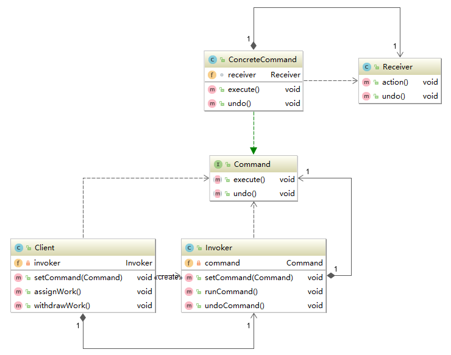

# 命令模式

### 定义
**定义**：将请求和请求的接收者封装在一个对象中，实现请求调用者和接收者之间的解耦。

### UML类图



Command：定义命令的接口，声明执行的方法，用来封装请求和请求接收者。

ConcreteCommand：命令接口实现对象，是“虚”的实现；通常会持有接收者，并调用接收者的功能来完成命令要执行的操作，具有执行和撤销两个动作。

Receiver：接收者，真正执行命令的对象。任何类都可能成为一个接收者，只要它能够实现命令要求实现的相应功能。

Invoker：要求命令对象执行请求，通常会持有命令对象，可以持有很多的命令对象。这个是客户端真正触发命令并要求命令执行相应操作的地方，也就是说相当于使用命令对象的入口。

Client：创建具体的命令对象，并且设置命令对象的接收者。注意这个不是我们常规意义上的客户端，而是在组装命令对象和接收者，或许，把这个Client称为装配者会更好理解，因为真正使用命令的客户端是从Invoker来触发执行。

### 演示
朱老板店里最近新招了三个帮手，小王、小李和小赵。小王是专门负责跑腿了，老板然他传个话、叫个人什么的他都很勤快。小李和小赵就是专门负责收集配件组装电脑的人，他们两个是各干各的。

有一天，店里来了个顾客要配电脑，但是这位顾客还有点特殊，他来之前就和朱老板商量过了，要什么样的配置朱老板就已经写了下来，朱老板就叫小王把配置清单传给装电脑的小李和小赵并告诉他们把电脑按配置装好。

这样一个过程就是一个命令模式的一个具体实现，Client就是朱老板，Invoker就是小王，Receiver就是小李和小赵，朱老板要让小李和小赵做事情的这一行为就是Command。

***
代表店里的员工小李和小赵。
```java
public class Receiver {

    public void action() {
        System.out.println(this.toString() + "  我要开始装电脑了");
    }

    public void undo() {
        System.out.println(this.toString() + "  电脑被我拆掉了");
    }
}
```

代表具体的命令，即老板要让给小李和小赵做事情。
```java
public class ConcreteCommand implements Command {

    Receiver receiver;

    public ConcreteCommand(Receiver receiver) {
        this.receiver = receiver;
    }

    @Override
    public void execute() {
        receiver.action();
    }

    @Override
    public void undo() {
        receiver.undo();
    }

}
```

即小王，监督命令的执行，只是一个传递者。
```java
public class Invoker {

    private Command command;

    public Invoker() {}

    public Invoker(Command command) {
        this.command = command;
    }

    public void setCommand(Command command) {
        this.command = command;
    }

    public void runCommand() {
        command.execute();
    }

    public void undoCommand() {
        command.undo();
    }
}
```

这个类是朱老板，发出请求，封装成命令给小王，他不清楚具体执行这个请求的人是谁，只知道传递命令的人。
```java
public class Client {

    private Invoker invoker;

    public Client() {
        invoker = new Invoker();
    }

    public void setCommand(Command command) {
        invoker.setCommand(command);
    }

    public void assignWork() {
        invoker.runCommand();
    }

    public void withdrawWork() {
        invoker.undoCommand();
    }

}
```

在这里，老板发起了一个请求，即装电脑，然后封装成命令发布给了小王，小王将这个命令给了小李和小赵，并让小李或者小赵执行这个请求。在这个过程中，老板是不知道请求是小李执行的还是小赵执行的，小王也不知道这个请求是什么。

```java
public class Main {
    public static void main(String[] args) {
        Client client = new Client(); //朱老板
        Receiver receiver = new Receiver(); //小李或小赵

        Command command = new ConcreteCommand(receiver); //封装命令
        client.setCommand(command); //把命令告诉小王

        client.assignWork(); //发起执行请求，让他们装电脑
        client.withdrawWork(); //老板反悔了，发起撤销请求，让他们拆电脑
    }
}
```

```
com.xiaobai.command.abs.Receiver@ba4d54  我要开始装电脑了
com.xiaobai.command.abs.Receiver@ba4d54  电脑被我拆掉了
```

这里的这个“我”，老板不知道是小李还是小赵，这样就做到了请求的发起者和接收者解耦。

“拆电脑”、“装电脑”对小王来说也是不透明的，他并不知道究竟是干什么，只负责传达。

### 总结
1. 命令模式的本质是对命令进行封装，将发出命令的责任和执行命令的责任分割开。


2. 每一个命令都是一个操作：请求的一方发出请求，要求执行一个操作；接收的一方收到请求，并执行操作。


3. 命令模式允许请求的一方和接收的一方独立开来，使得请求的一方不必知道接收请求的一方的接口，更不必知道请求是怎么被接收，以及操作是否被执行、何时被执行，以及是怎么被执行的。


4. 命令模式使请求本身成为一个对象，这个对象和其他对象一样可以被存储和传递。


5. 命令模式的关键在于引入了抽象命令接口，且发送者针对抽象命令接口编程，只有实现了抽象命令接口的具体命令才能与接收者相关联。

##### 优点
1. 降低对象之间的耦合度。

2. 新的命令可以很容易地加入到系统中。

3. 可以比较容易地设计一个组合命令，创建一个MultiCommand类实现Command接口，然后在这个类加入多条命令，并且在execute()方法中一次执行它们。


```java
public class MultiCommand implements Command {

    private Command[] commands;

    MultiCommand(Command[] commands) {
        this.commands = commands
    }

    public void execute() {
        for (Command command : commands) {
          command.execute();
        }
    }

    public void undo() {
        //...
    }

}
```

4. 调用同一方法实现不同的功能。

##### 缺点
使用命令模式可能会导致某些系统有过多的具体命令类。因为针对每一个命令都需要设计一个具体命令类，因此某些系统可能需要大量具体命令类，这将影响命令模式的使用。
