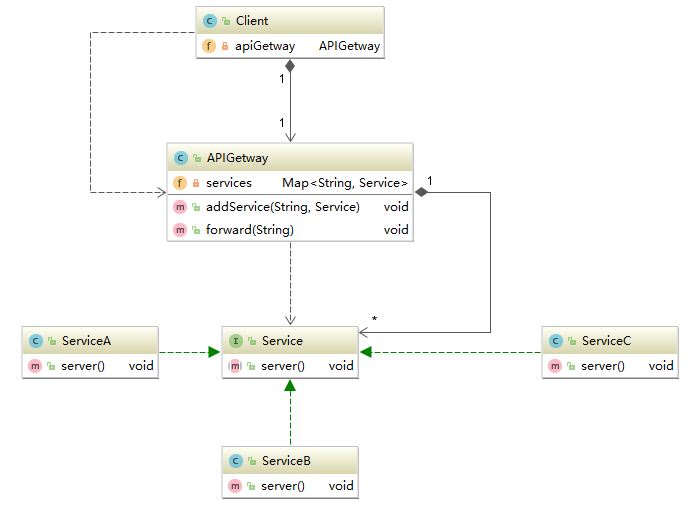

# 外观模式

### 定义
**定义**：提供了一个统一的接口，用来访问子系统中的一群接口。外观定义了一个高层接口，隐藏了系统的复杂性，并向客户端提供了一个可以访问系统的接口，让子系统更容易使用。

### 结构


SubSystem*：子系统，它们内部的接口可以按某种次序调用来访问数据资源。

Facade：这个外观类为子系统提供一个共同的对外接口。

Client：客户对象通过一个外观接口读写子系统中各接口的数据资源。

### 应用
API Gateway 是企业 IT 在系统边界上提供给外部访问内部接口服务的统一入口。
API网关是一个服务器，是系统的唯一入口。从面向对象设计的角度看，它与外观模式类似。在微服务架构中，API Gateway 是所有服务的入口，常用来进行用户验证和鉴权和请求的转发路由。


API Getway 就好比外观模式中的Facade，每一个服务就是SubSystem*。根据Client发来的请求，路由到某个服务。



```java
public interface Service {
    void server();
}

public class ServiceA implements Service {
    @Override
    public void server() {
        System.out.println("Request reached SERVICE-A!");
        //...复杂的方法调用
    }
}

public class ServiceB implements Service {
    @Override
    public void server() {
        System.out.println("Request reached SERVICE-B!");
        //...复杂的方法调用
    }
}

public class ServiceC implements Service {
    @Override
    public void server() {
        System.out.println("Request reached SERVICE-C!");
        //...复杂的方法调用
    }
}
```

```java
public class APIGetway {
    private Map<String, Service> services = new HashMap<>(8);

    public void addService(String name, Service service) {
        services.put(name, service);
    }

    public void forward(String request) throws IOException {
        if (services.containsKey(request)) {
            services.get(request).server();
        } else {
            throw new IOException("No Such Service!");
        }
    }
}
```

```java
public class Client {
    private APIGetway apiGetway;

    public Client(APIGetway apiGetway) {
        this.apiGetway = apiGetway;
    }

    public void sendRequest(String request){
        try {
            apiGetway.forward(request);
        } catch (IOException e) {
            e.printStackTrace();
        }
    }
}
```

测试类：
```java
public class Main {
    public static void main(String[] args) {
        APIGetway apiGetway = new APIGetway();
        apiGetway.addService("SERVICE-A",new ServiceA());
        apiGetway.addService("SERVICE-B",new ServiceB());
        apiGetway.addService("SERVICE-C",new ServiceC());

        Client client = new Client(apiGetway);

        client.sendRequest("SERVICE-A");
        client.sendRequest("SERVICE-B");
        client.sendRequest("SERVICE-C");
    }
}
```

```
Request reached SERVICE-A!
Request reached SERVICE-B!
Request reached SERVICE-B!
```

### 总结
真正的子系统中的接口不会像我所演示的这么简单，如果不通过外观模式提供的统一接口，那么完成某一项特定的业务所需要的操作可能会很复杂。

不使用外观模式完成一项业务:
```java
SubSystem1.mothod1();
SubSystem2.mothod2();
SubSystem3.mothod3();
SubSystem4.mothod4();
//...
```

使用外观模式：
```java
facade.service();
```

因此外观模式可以封装一套完整的业务流程，使细粒度的操作不暴露在业务调用者下。
##### 优点
1. 实现了子系统与客户端之间的松耦合关系。

2. 客户端屏蔽了子系统组件，减少了客户端所需处理的对象数目，并使得子系统使用起来更加容易。

##### 缺点
1. 通过外观模式只能完成某一特定的业务，难以实现某些特定的细粒度的操作。

##### 应用场景
1. 为复杂的模块或子系统提供外界访问的模块；

2. 在层析结构中，可以使用外观模式定义系统的每一层的入口。
