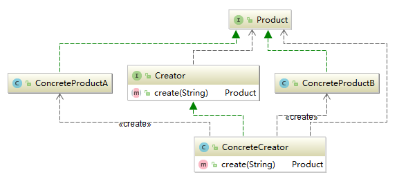
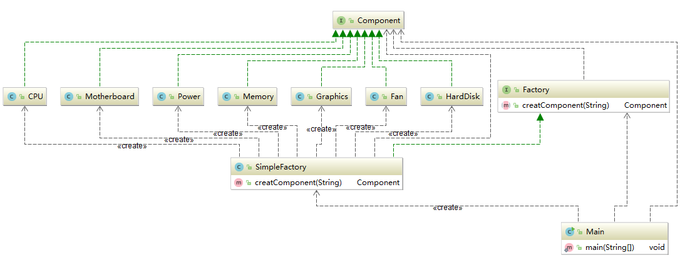
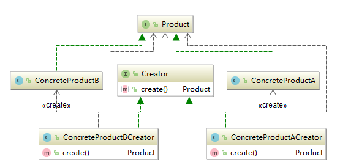
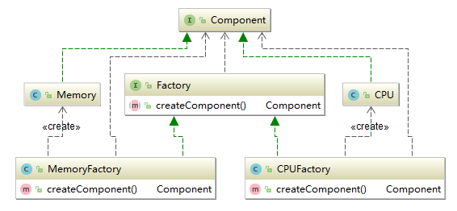
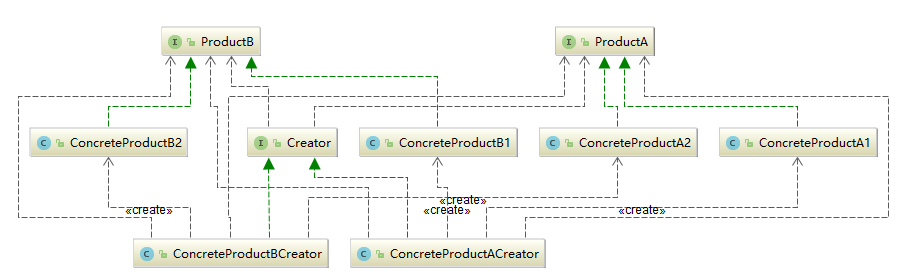
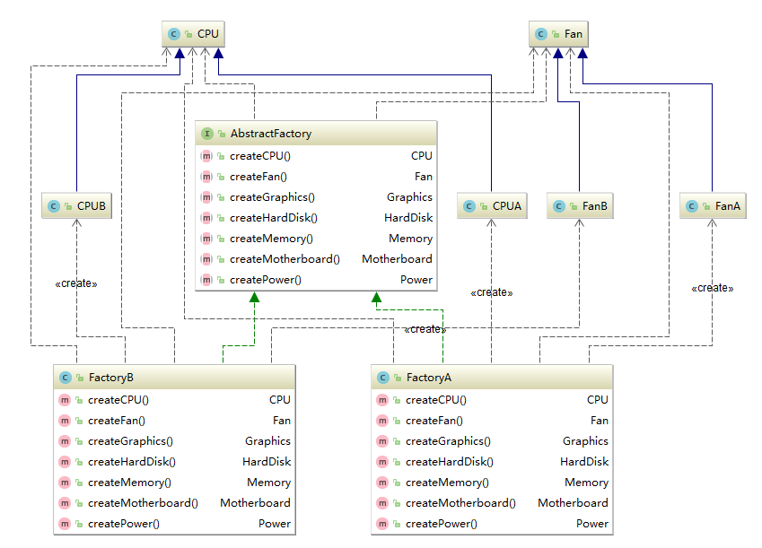

# 工厂模式
### 定义
**定义**：将对象实例的创建过程整合到另一个工厂对象中，用工厂对象创建对象来代替new。

工厂模式又可以分为：简单工厂、工厂方法模式、抽象工厂模式等。

### 简单工厂
> 简单工厂的实质是由一个工厂类根据传入的参数，动态决定应该创建哪一个产品类（这些产品类继承自一个父类或接口）的实例。严格意义上来说，简单工厂不在23种设计模式之中。

抽象意义上的关系图：



朱老板使用装饰者模式修改了自己的电脑店，使他配电脑的流程变得更加清晰了，销售的业务流程也越来越快。但是朱老板在做生意的过程中也遇到过一些顾客不是来配电脑的，而是来买配件的。朱老板为了满足他们，就给new一个配件出来，

```java
  Component component = new CPU();
  Component component = new Memory();
  //...其他配件类似
```

随着客户越来越多，不停的new配件让朱老板觉得有点力不从心。他琢磨了一阵子，想到了换一种方式来得到配件，用一个别的类来把这些new的过程从他的主业务中分离出去。
```java
public interface Factory {
    Component createComponent(String arg);
}

public class SimpleFactory implements Factory {
    @Override
    public Component createComponent(String arg) {
        if ("CPU".equalsIgnoreCase(arg)) {
            return new CPU();
        } else if ("Fan".equalsIgnoreCase(arg)) {
            return new Fan();
        } else if ("Graphics".equalsIgnoreCase(arg)) {
            return new Graphics();
        } else if ("HardDisk".equalsIgnoreCase(arg)) {
            return new HardDisk();
        } else if ("Memory".equalsIgnoreCase(arg)) {
            return new Memory();
        } else if ("Motherboard".equalsIgnoreCase(arg)) {
            return new Motherboard();
        } else if ("Power".equalsIgnoreCase(arg)) {
            return new Power();
        } else {
            return null;
        }
    }
}
```

之后获取配件装配电脑的过程就可以变成这样。
```java
  Factory simpleFactory = new SimpleFactory();
  Component motherboard = simpleFactory.createComponent("Motherboard");
  Component fan = simpleFactory.createComponent("fan");
  //..其他配件类似
```
这就是**简单工厂**，这几个类之间的关系是这样的，



如果去掉Factory接口，将SimpleFactory类中的createComponent(String arg)方法改为静态，那么这个简单工厂就变成了一个**静态工厂**，实例由静态方法生成。

但是问题又来了，朱老板店里又上架了一款网卡，那么他要在增加一个网卡类并且实现Component接口，同时在SimpleFactory的createComponent(String arg)增加对网卡判断的分支，
```java
  else if ("NetworkCard".equalsIgnoreCase(arg)){
      return new NetworkCard();
  }
```
这样每次来了个新品种都要对代码进行修改。从设计原则上来考虑，每次新增配件，都需要对SimpleFactory的代码进行修改，这**显然违反了开闭原则**。

### 工厂方法模式
>定义一个创建产品对象的工厂接口，将实际创建工作推迟到子类当中，核心工厂类不再负责产品的创建。

抽象意义上的关系图：



既然这样，那就把工厂分开来，然他们各司其职，专门提供某一种配件。这样，在新增配件的时候，就不会面临违反开闭原则的问题了。

```java
public interface Factory {
    Component createComponent();
}

//CPU工厂
public class CPUFactory implements Factory {
    @Override
    public Component createComponent() {
        return new CPU();
    }
}

//内存条工厂
public class MemoryFactory implements Factory {
    @Override
    public Component createComponent() {
        return new Memory();
    }
}

//其他工厂类似
```
当朱老板想要某一个配件的时候，只需要查找对应的工厂就可以完成配件的获取。

```java
public class Main {
    public static void main(String[] args) {
        Factory factory = new CPUFactory();
        Component AMDCPU = factory.createComponent();
        Component INTELCPU = factory.createComponent();
    }
}
```

它们的关系是这样的。



这样一来，我们就将不符合开闭原则的简单工厂改造成了更好的工厂方法模式。使用工厂方法模式，如果要新增Component，只需要开辟一个新的工厂实现Factory接口即可，不需要对现有的代码修改。

### 抽象工厂模式
>抽象工厂模式是所有形态的工厂模式中最为抽象和最具一般性的一种形态。抽象工厂模式可以向客户端提供一个接口，使客户端在不必指定产品的具体的情况下，创建多个产品族中的产品对象。

抽象意义上的关系图：



产品族就是位于不同产品等级结构中，功能相关联的产品组成的家族。朱老板店里的生意越来越好，为了对付来配电脑的小白们，朱老板就特地列出了几个推荐装机配置：推荐配置A、推荐配置B等。

那么在朱老板的店里CPU、内存、电源等配件就是不同等级的产品，这些不同产品组成的推荐配置就成了产品族，因为推荐配置里的CPU、内存、电源等都是来自于不同的产品等级结构，而这些CPU、内存、电源等又能组成一台完整的计算机，它们是相互关联的，所以认为这些推荐配置就是产品族。

为此，朱老板特意改动了自己的代码，加拉一个AbstractFactory接口充当抽象工厂。

```java
public interface AbstractFactory {
    CPU createCPU();
    Fan createFan();
    Graphics createGraphics();
    HardDisk createHardDisk();
    Memory createMemory();
    Motherboard createMotherboard();
    Power createPower();
}
```

```java
public class FactoryA implements AbstractFactory {
    @Override
    public CPU createCPU() { return new CPUA(); }

    @Override
    public Fan createFan() { return new FanA(); }

    @Override
    public Graphics createGraphics() { return new GraphicsA(); }

    @Override
    public HardDisk createHardDisk() { return new HardDiskA(); }

    @Override
    public Memory createMemory() { return new MemoryA(); }

    @Override
    public Motherboard createMotherboard() { return new MotherboardA(); }

    @Override
    public Power createPower() { return new PowerA(); }
}
```

```java
public class FactoryB implements AbstractFactory {
    @Override
    public CPU createCPU() { return new CPUB(); }

    @Override
    public Fan createFan() { return new FanB(); }

    @Override
    public Graphics createGraphics() { return new GraphicsB(); }

    @Override
    public HardDisk createHardDisk() { return new HardDiskB(); }

    @Override
    public Memory createMemory() { return new MemoryB(); }

    @Override
    public Motherboard createMotherboard() { return new MotherboardB(); }

    @Override
    public Power createPower() { return new PowerB(); }
}
```

土豪小芳从朱老板这里买的一台配置A的电脑出毛病了，总是用一会之后就自动关机，拿到店里一检查，是CPU上的风扇不会转了。这就要找一个风扇给它换上去了，朱老板知道是配置A之后，就去找配置A工厂，让它拿一个风扇出来，

```java
  AbstractFactory abstractFactory = new FactoryA();
  Fan fan = abstractFactory.createFan();
```

之后又来了一个配置B的，是硬盘坏了，朱老板就找配置B的工厂拿硬盘，

```java
  AbstractFactory abstractFactory = new FactoryB();
  HardDisk hardDisk = abstractFactory.createHardDisk();
```

朱老板设计的类之间的关系是这样的，只列出了CPU和Fan配件其他配件的关系也类似。抽象工厂模式一般用于具有产品树和产品族的场景下。


### 总结
1. **简单工厂**将对象的创建过程独立到了一个工厂类中，它能根据参数生成多种不属于同一父类的的实例。因此想要增加新的类到工厂中去时，不得不修改代码，违背了开闭原则。
2. **工厂方法模式**是为了克服简单工厂不符合开闭原则而设计的，新增类时，只要增加相对于的工厂即可。
3. **抽象工厂模式**抽象工厂模式可以向客户端提供一个接口，使客户端在不必指定产品的具体的情况下，创建多个产品族中的产品对象。抽象工厂模式一般用于具有产品树和产品族的场景下。
4. 工厂模式的根本目的就是将对象的创建过程从主业务中分离出去，让客户端无需关注如何建立对象的过程。同时，也增加了系统的可维护性和可扩展性，优化了结构，因此增加一些代码量时值得的。
5. 工厂模式的设计中使用到了另外一个重要的原则，依赖倒置原则：模块间的依赖通过抽象发生，实现类之间不发生直接的依赖关系，其依赖关系是通过接口或抽象类产生的;接口或抽象类不依赖实现类;实现类依赖接口或抽象类。工厂中的产品使用的都是抽象接口的引用，而非具体类的引用。
