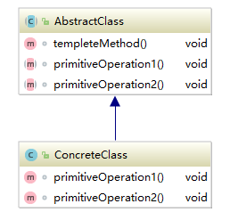
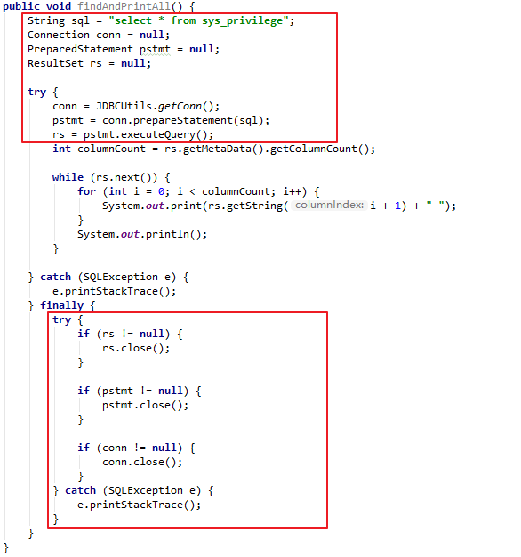

# 模板方法模式

### 定义
**定义**：在一个方法中定义一个算法的骨架，而将一些步骤延迟到子类中。

模板方法使得子类可以在不改变算法结构的情况下，重新定义算法中的某些步骤。

### 结构


AbstractClass：包含了模板方法和两个模板方法所用到的抽象函数。

templeteMethod()：调用了两个抽象函数。
```java
void templeteMethod() {
    primitiveOperation1();
    primitiveOperation2();
}
```

ConcreteClass：具体实现了两个抽象方法，这样的类可以有很多个。

### 应用
模板方法模式是将不可变的代码或者逻辑类似的代码抽离出来，放在一个抽象基类中并把可变部分定义为它的抽象方法，封装进一个算法的步骤，并且允许子类来为可变的部分提供实现。

以使用JDBC查询数据库为例，图中红框中的代码为不可变的部分，在所有JDBC查询中都是一样的。其余的代码则会根据实际的操作而有所变化。



所以我们使用模板方法模式来重构它。

```java
public abstract class JDBCTemplete {
    protected String sql = "select * from sys_privilege";
    protected Connection conn = null;
    protected PreparedStatement pstmt = null;
    protected ResultSet rs = null;

    public final Object execute() throws SQLException {
        getConnection();
        getprepareStatement();
        getResultSet();
        Object obj = handle();
        if (isPrint()) {
            printData();
        }
        close();
        return obj;
    }

    public boolean isPrint() {
        return true;
    }

    public void setSql() {}

    public abstract Object handle () throws SQLException;

    public void getConnection() {
        conn = JDBCUtils.getConn();
    }

    public void getprepareStatement() throws SQLException {
        pstmt = conn.prepareStatement(sql);
    }

    public void getResultSet() throws SQLException {
        rs = pstmt.executeQuery();
    }

    public void printData() throws SQLException {
        int columnCount = rs.getMetaData().getColumnCount();

        rs.beforeFirst();
        while (rs.next()) {
            for (int i = 0; i < columnCount; i++) {
                System.out.print(rs.getString(i + 1) + " ");
            }
            System.out.println();
        }
    }

    public void close() throws SQLException {
        if (rs != null) {
            rs.close();
        }

        if (pstmt != null) {
            pstmt.close();
        }

        if (conn != null) {
            conn.close();
        }
    }
}
```

这个模板方法中包含六个步骤：
1. findAndPrintAll() 为固定的算法步骤，定义为final是为了防止子类修改步骤的执行顺序。

2. getConnection() 获取Connection对象。

3. getprepareStatement() 获取PrepareStatementd对象。

4. getResultSet() 获取ResultSet对象。

5. handle() 主查询逻辑。

6. print() 打印数据。

7. close() 关闭资源。

8. isPrint() 决定是否打印数据的钩子函数。

9. setSql() 自定义SQL查询语句的钩子函数。

现在使用这个模板来实现一个过程：查询数据库中的所有数据封装在User对象中并返回一个ArrayList列表，不打印数据。

```java
public class User {
    private Integer id;
    private String name;
    private String url;

    //省略getter和setter
}
```
数据库中存放的数据：

| id  | privilege_name | privilege_url |
| --- | -------------- | ------------- |
| 1   | 用户管理       | /users        |
| 2   | 角色管理       | /roles        |
| 3   | 系统日志       | /logs         |
| 4   | 人员维护       | /persons      |
| 5   | 单位维护       | /companies    |

```java
public class Templete extends JDBCTemplete {
    @Override
    public boolean isPrint() {
        return false;
    }

    @Override
    public Object handle() throws SQLException {
        ArrayList<User> users = new ArrayList<>();

        while (rs.next()) {
            User user = new User();
            user.setId(Integer.valueOf(rs.getString(1)));
            user.setName(rs.getString(2));
            user.setUrl(rs.getString(3));
        }

        return users;
    }
}
```

测试类：
```java
public class Main {
    public static void main(String[] args) {
        Templete templete = new Templete();
        try {
            ArrayList<User> users = (ArrayList<User>) templete.execute();
            users.forEach(System.out::println);
        } catch (SQLException e) {
            e.printStackTrace();
        }
    }
}
```

输出：
```
User{id=1, name='用户管理', url='/users'}
User{id=2, name='角色管理', url='/roles'}
User{id=3, name='系统日志', url='/logs'}
User{id=4, name='人员维护', url='/persons'}
User{id=5, name='单位维护', url='/companies'}
```

使用模板方法模式之后，主业务中的代码就会变得非常简洁。

### 总结
1. 保护抽象类中定义算法顺序的方法不被子类修改。

2. 分离可变及不可变部分，让子类自己决定可变部分的实现。

3. 让算法的具体实现对子类开放，对其他类关闭。

4. 在模板方法中可以定义一些钩子函数，来修改模板方法的执行逻辑而不是执行顺序。
