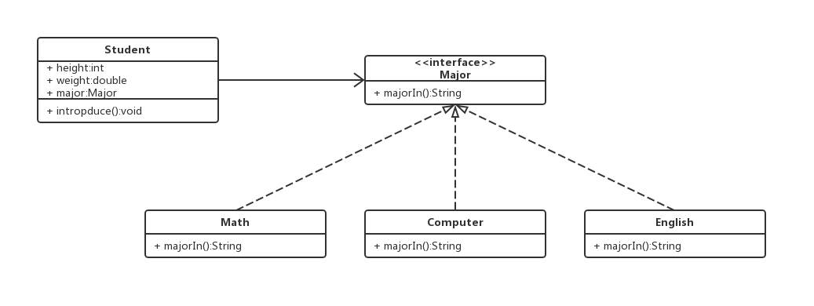

1. # 策略者模式
## 定义
**定义**：策略者模式定义了一系列的算法，并将每一个算法封装起来，而且使他们可以相互替换，让算法独立于使用它的客户而独立变化。

这个模式将类中可变的部分抽象出来封装成一类算法。应用场景之间的切换无需修改代码，只要加载不同的算法就能实现不同场景下的不同功能。

策略者模式的出现是为了弥补继承过程中代码复用性的不足。它完美的体现除了“多用组合，少用继承”的设计原则。

## UML类图
我们以大学生为例子来演示策略者模式的特点。在下文中，定义了一个Student类和Major接口。对于所有学术来说，身高和体重都是所有人共有的特征。但是每个人的专业可能有所不同，所以抽象出来设计成接口。


## 代码结构
**Student.java**
```java
public class Student {
	public double height;
	public double weight;
	Major major;

	public Student(double height, double weight, Major major) {
		this.height = height;
		this.weight = weight;
		this.major = major;
	}

	public Student(Major major) {
		this(0, 0, major);
	}

	//省略getter和setter

	public void introduce() {
		System.out.println("height=" + height + ", " + "weight=" + weight + ", "+major.majorIn());
	}
}
```

**Major.java**
```java
public interface Major {
	String majorIn();
}

```

**Math.java**
```java
public class Math implements Major {
	public String majorIn() {
		return "I major in Math.";
	}
}
```

**Computer.java**
```java
public class Computer implements Major {
	public String majorIn() {
		return "I major in Computer.";
	}
}
```

**English.java**
```java
public class English implements Major {
	public String majorIn() {
		return "I major in English.";
	}
}
```

## 运行演示
### 演示代码
```java
public class Main {
  public static void main(String[] args) {
    Student student1 = new Student(170,60, new Math());
    Student student2 = new Student(177, 65, new English());
    Student student3 = new Student(160, 50, new English());

    student1.introduce();
    student2.introduce();
    student3.introduce();
  }
}
```

### 输出结果
```
height=170.0, weight=60.0, I major in Math.
height=177.0, weight=65.0, I major in English.
height=160.0, weight=50.0, I major in English.
```
