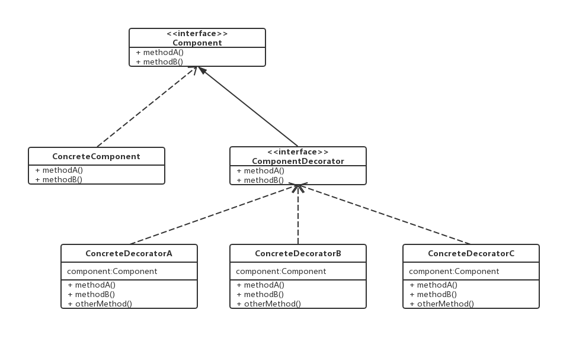
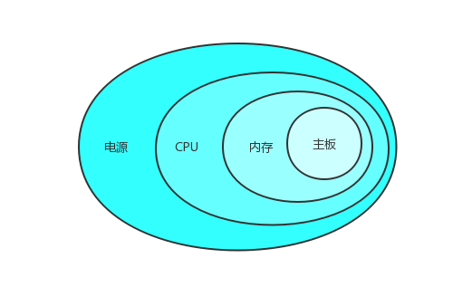
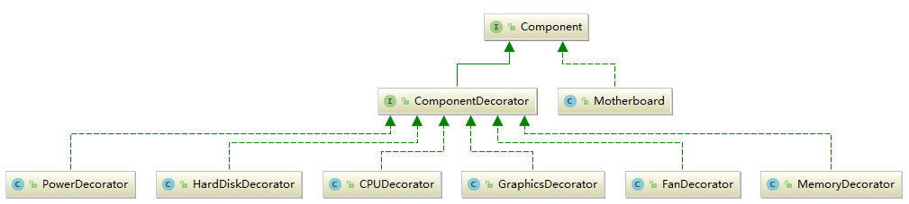
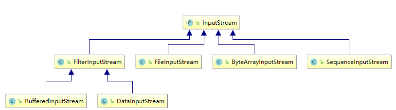

# 装饰者模式

### 定义

**定义**：动态地将责任附加到对象上。若要扩展功能，装饰者模式提供了比继承更有弹性的替代方案。

为了满足类设计的开闭原则，装饰者模式应运而生。使用这个模式可以在扩展类功能和特性是最大限度的减少对类的修改。通过对类进行装饰来实现功能的扩展。

### UML类图


### 演示
朱老板开了一家电脑配件店，专门给别人配电脑。他家的配件有电源，硬盘，CPU，显卡，风扇，内存条和主板。

一开始朱老板简单的每个上门的客人的需求写了下来，做成一个类。比如小明要一台有主板，电源，硬盘，CPU的电脑。朱老板就创建了这样一个类。

```java
public class XiaoMing {
    private Motherboard motherboard;
    private Power power;
    private HardDisK hardDish;
    private CPU cpu;

    public String description(){
        //...列出所有配件
    }

    public double cost(){
        //...把所有的配件价格加起来
    }
}
```

确实，这样能得出出小明配的电脑的价格和具体配置。但是，如果小红也来配电脑，小绿也来配电脑，可是他们想要的配置都不一样，朱老板又要重新件类来描述他们两个人了，这属实麻烦。但是聪明的朱老板又想到了一个办法，以小明的要求为例。



把小明的每个要求包装起来。后一个包裹前一个，然后每一个配件都设置成类似的结构。

```java
//具体某一个配件
public class XXX {

    //前一个配件
    private Component component;

    public XXX(Component component) {
        this.component = component;
    }

    //配置信息
    public String description() {
        return component.description()+",配置信息";
    }

    //价格计算
    public double cost() {
        return component.cost()+price;
    }
}
```

特殊的是主板，因为其他的配件都要安装在主板上面，没了主板就装不了电脑了。所以机智的朱老板把主板写成了这样。也就是说每一次的包装都应该是以主板为起点的。
```java
public class Motherboard {
    public String description() {
        return "配置信息";
    }

    public double cost() {
        return 100;
    }
}
```
这样一来，朱老板只要把自己店里的配件做成上面类的样子，然后来了一个顾客，就一个配件一个配件的包装上去。最后包装完了，调用一下description()方法和cost()方法就能轻松得出配置和价格了。
这乍一看没差啊，还得写类啊，但是这样一来复用性就大大提高了，不用每次都写一遍配件。

另外本着针对接口编程而不是针对实现编程的原则，为了减少耦合度，再加上两个接口来统一一下，这样就完美了。


### 代码

```java
public interface Component {
    String description();
    double cost();
}
```

```java
public interface ComponentDecorator extends Component {}
```

```java
public class Motherboard implements Component{
    @Override
    public String description() {
        return "技嘉 M-ATX（紧凑型）";
    }

    @Override
    public double cost() {
        return 100;
    }
}
```

```java
public class PowerDecorator implements ComponentDecorator{

    private Component component;

    public PowerDecorator(Component component) {
        this.component = component;
    }

    @Override
    public String description() {
        return component.description()+",电源500W";
    }

    @Override
    public double cost() {
        return component.cost()+400;
    }
}
```

```java
public class HardDiskDecorator implements ComponentDecorator {

    private Component component;

    public HardDiskDecorator(Component component) {
        this.component = component;
    }

    @Override
    public String description() {
        return component.description()+",固态硬盘 480G";
    }

    @Override
    public double cost() {
        return component.cost()+400;
    }
}
```

```java
public class CPUDecorator implements ComponentDecorator{

    private Component component;

    public CPUDecorator(Component component) {
        this.component = component;
    }

    @Override
    public String description() {
        return component.description()+",Intel i7 8700";
    }

    @Override
    public double cost() {
        return component.cost()+900;
    }
}
```

```java
public class GraphicsDecorator implements ComponentDecorator {

    private Component component;

    public GraphicsDecorator(Component component) {
        this.component = component;
    }

    @Override
    public String description() {
        return component.description()+",映众/微星 GTX1060";
    }

    @Override
    public double cost() {
        return component.cost()+1200;
    }
}
```

```java
public class FanDecorator implements ComponentDecorator {

    private Component component;

    public FanDecorator(Component component) {
        this.component = component;
    }

    @Override
    public String description() {
        return component.description()+",风冷";
    }

    @Override
    public double cost() {
        return component.cost()+50;
    }
}
```

```java
public class MemoryDecorator implements ComponentDecorator {

    private Component component;

    public MemoryDecorator(Component component) {
        this.component = component;
    }

    @Override
    public String description() {
        return component.description()+",DDR4 2400 16GB";
    }

    @Override
    public double cost() {
        return component.cost()+800;
    }
}
```

### 测试
下面是土豪小芳的配置需求：CPU，两条内存，主板，显卡，硬盘，风扇，电源。能加的都加上了。
```java
public class Main {
    public static void main(String[] args) {
        Component computer = new Motherboard();
        computer= new CPUDecorator(computer);
        computer = new GraphicsDecorator(computer);
        computer = new MemoryDecorator(computer);
        computer = new MemoryDecorator(computer);
        computer = new HardDiskDecorator(computer);
        computer = new FanDecorator(computer);
        computer = new PowerDecorator(computer);

        //或者写成这样
        //Component computer = new PowerDecorator(new FanDecorator(new HardDiskDecorator(new MemoryDecorator(new MemoryDecorator(new GraphicsDecorator(new CPUDecorator(new Motherboard())))))));

        System.out.println(computer.description()+"\n"+computer.cost());
    }
}
```
然后朱老板调用了description()和cost()，得到了配置信息和价格。

```
技嘉 M-ATX（紧凑型）,Intel i7 8700,映众/微星 GTX1060,DDR4 2400 16GB,DDR4 2400 16GB,固态硬盘 480G,风冷,电源500W
4650.0
```

### Java中装饰者模式的体现



简直是一模一样啊！节点流就是类似于电脑配件里的主板，而继承FilterInputStream的过滤流则相当于其他的配件。在创建流时，我们大多数的时候会结合节点流和过滤流。
```java
InputStream inputStream = new BufferedInputStream(new DataInputStream(new FileInputStream("xxx.txt")));
```
和上面装电脑的过程十分类似。
```java
Component computer = new PowerDecorator(new FanDecorator(new HardDiskDecorator(new MemoryDecorator(new MemoryDecorator(new GraphicsDecorator(new CPUDecorator(new Motherboard())))))));
```
