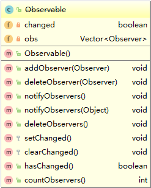
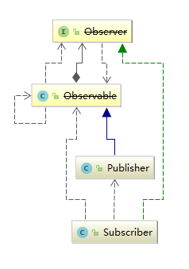

# 观察者模式

### 定义
**定义**：建立了对象之间一对多的依赖关系，这样一来，当一个对象的状态改变时，它的所有依赖者都会收到通知并自动更新。

观察者模式中，被观察对象状态发生改变时，会通知所有的观察者。这里又有PUSH和PULL的两种模式。PUSH是被观察对象主动将内容更新到观察者之上，而PULL则是观察者主动向被观察对象获取更新内容。

观察者模式经常出现在Java的GUI、Web和Spring等地方。

### UML类图
在Java的java.util包中其实已经包含了观察者模式设计的一些最基本的东西：Observable类和Observer接口。但是Observable类和Observer接口在Java9之后就被注释为Deprecated。



Observable类可以认为是“可以被观察”的一类事物，其中changed是一个boolean类型的成员变量表示该事物是否发生了改变，obs中维护了一个有观察者组成的Vector列表。其中起重要作用的是setChanged()方法和notifyObservers()方法。

```java
public void notifyObservers(Object arg) {

     //临时对象数组，存储观察者
    Object[] arrLocal;

    synchronized (this) {
        if (!changed)
            return;
        arrLocal = obs.toArray();
        //将changed设置为false
        clearChanged();
    }

    //逆序轮询通知观察者
    for (int i = arrLocal.length-1; i>=0; i--)
        ((Observer)arrLocal[i]).update(this, arg);
}

protected synchronized void setChanged() {
    changed = true;
}
```
changed成员变量为true是才能将状态更新通知给所有的观察者。所以在每次通知观察者更新状态时，需要调用setChanged()方法。


Observer接口是观察“可以被观察”事物的事物，update方法用来更新状态。第一个参数是被观察对象，第二个参数是被观察对象传递过来的信息。


### 演示
以出版社（publisher）和订阅者（subscriber），利用Java提供的组件来设计一个简单的观察·者模式的实现。



##### 以PUSH方式
Publisher.class
```java
public class Publisher extends Observable {
    private ArrayList<String> books;

    Publisher(){
        books = new ArrayList<>();
    }

    public void addBook(String book){
        books.add(book);
        super.setChanged();
        super.notifyObservers(books);
    }
}
```

Subscriber.class
```java
public class Subscriber implements Observer {

    private String name;

    Subscriber(String name){
        this.name = name;
    }

    @Override
    public void update(Observable o, Object arg) {
        if(arg instanceof ArrayList){
            ArrayList<String> books = (ArrayList<String>)arg;
            System.out.print(name+" ");
            books.stream().forEach(book -> System.out.print(book+" "));
            System.out.println();
        }
    }
}
```

Main.class
```java
public class Main {
    public static void main(String[] args) {
        Publisher publisher = new Publisher();

        publisher.addObserver(new Subscriber("A"));
        publisher.addObserver(new Subscriber("B"));
        publisher.addObserver(new Subscriber("C"));

        System.out.println("Publisher出新书了！");
        publisher.addBook("数据结构");

        System.out.println("Publisher出新书了！");
        publisher.addBook("操作系统");

        System.out.println("Publisher出新书了！");
        publisher.addBook("模拟电路");

    }
}
```
```
Publisher出新书了！
C 数据结构
B 数据结构
A 数据结构
Publisher出新书了！
C 数据结构 操作系统
B 数据结构 操作系统
A 数据结构 操作系统
Publisher出新书了！
C 数据结构 操作系统 模拟电路
B 数据结构 操作系统 模拟电路
A 数据结构 操作系统 模拟电路
```

##### 以PULL方式
Publisher.class
```java
public class Publisher extends Observable {

    //...代码不变，修改下面的

    public void addBook(String book){
        books.add(book);
        super.setChanged();
        super.notifyObservers();
    }

    public ArrayList<String> getBooks() {
        return books;
    }
}

```

Subscriber.class
```java
public class Subscriber implements Observer {

    //...代码不变，修改下面的

    @Override
    public void update(Observable o, Object arg) {
        if(o instanceof Publisher){
            Publisher publisher = (Publisher)o;

            System.out.print(name+" ");
            publisher.getBooks().stream().forEach(book -> System.out.print(book+" "));
            System.out.println();
        }
    }
}
```

Main.class
```
Publisher出新书了！
C 数据结构
B 数据结构
A 数据结构
Publisher出新书了！
C 数据结构 操作系统
B 数据结构 操作系统
A 数据结构 操作系统
Publisher出新书了！
C 数据结构 操作系统 模拟电路
B 数据结构 操作系统 模拟电路
A 数据结构 操作系统 模拟电路
```

### 缺点
1. Java提供的Observable类对订阅者的轮询使按固定顺序的，先订阅的后收到。这样就增加了两者之间的耦合度，毕竟设计这个模式的目的就是降低交互对象之间的耦合度。
```java
for (int i = arrLocal.length-1; i>=0; i--)
    ((Observer)arrLocal[i]).update(this, arg);
```
2. Observable是类而不是接口。因为Java没有多继承，这样就限制了发布者的扩展性和削弱了代码的复用性。

3. Observable类将这两个最关键的方法定义成了protected，这就意味这只能继承observable类，否则你就无法调用这两个方法，也就不能实现观察者模式。这样一来，就不可能将Observable类组合到其他的类中去，违反了“多用组合，少用继承”的设计原则。
```java
protected synchronized void setChanged() {
        changed = true;
}
protected synchronized void clearChanged() {
    changed = false;
}
```
