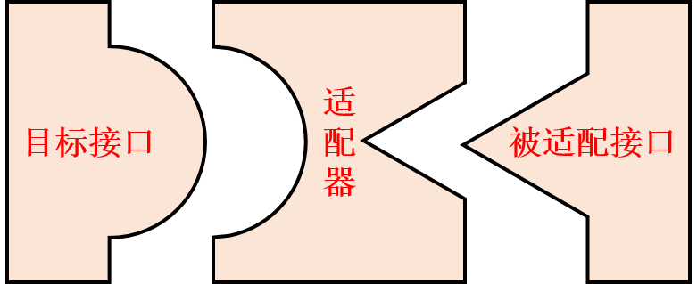
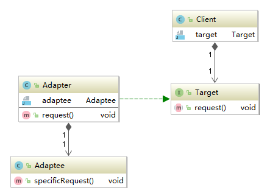
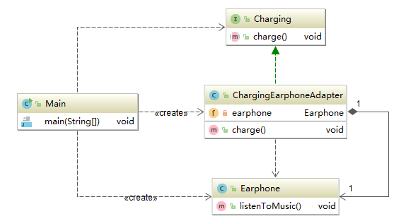

# 适配器模式

### 定义
**定义**：将一个类的接口，装换成客户期望的另一个接口。 让原本不兼容的类可以合作无间。



保留现有的接口，通过使用适配器，向客户提供他所期望的接口，以满足客户。
### 结构
适配器模式的别名为包装器(Wrapper)模式，它分为对象适配器和类适配器。因为类适配器需要使用多继承，但Java不支持多继承，所以不再本文的讨论范围内。在适配器模式定义中所提及的接口是指广义的接口，它可以表示一个方法或者方法的集合。

对象适配器的结构图：



1. Target(目标抽象类)：目标抽象类定义客户所需的接口，可以是一个抽象类或接口，也可以是具体类。在类适配器中，由于Java语言不支持多重继承，所以它只能是接口。

2. Adapter(适配器类)：它可以调用另一个接口，作为一个转换器，对Adaptee和Target进行适配。它是适配器模式的核心。

3. Adaptee(被适配类)：被适配类即被适配的角色，它定义了一个已经存在的接口，这个接口需要被适配成客户希望的接口。

### 实现

现在市面上大多数的智能手机都放弃了使用耳机接口，转而将耳机接口和充电接口整合到了一起。这样做使手机的外观更加简洁了，但是也带来了一个问题，使用耳机插孔的耳机就无法插在充电口上了。所以手机厂商基本上都会提供一个充电接口-耳机接口的转换。



Charging接口：智能手机的充电接口。

```java
public interface Charging {

    void charge();

}
```

Earphone类：普通的耳机。

```java
public class Earphone {

    public void listenToMusic() {
        System.out.println("Listening to the music!");
    }

}
```

ChargingEarphoneAdapter类: 充电接口转换为耳机接口的适配器。

```java
public class ChargingEarphoneAdapter implements Charging {
    private Earphone earphone;

    public ChargingEarphoneAdapter(Earphone earphone) {
        this.earphone = earphone;
    }

    @Override
    public void charge() {
        earphone.listenToMusic();
    }
}
```

客户端测试类：
```java
public class Main {

    public static void main(String[] args) {
        //普通耳机
        Earphone earphone = new Earphone();

        //耳机接口-充电接口适配器
        Charging charging = new ChargingEarphoneAdapter(earphone);

        //通过适配器使用充电接口听音乐
        charging.charge();
    }

}
```

结果:
```
Listening to the music!
```

### 总结

##### 优点：
1. 将目标类和适配者类解耦，通过引入一个适配器类来重用现有的适配者类，无需修改原有结构。

2. 增加了类的透明性和复用性，将具体的业务实现过程封装在适配者类中，对于客户端类而言是透明的，而且提高了适配者的复用性，同一适配者类可以在多个不同的系统中复用。

3. 灵活性和扩展性都非常好，通过使用配置文件，可以很方便的更换适配器，也可以在不修改原有代码的基础上 增加新的适配器，完全复合开闭原则。

##### 缺点：
1. 一次最多只能适配一个适配者类，不能同时适配多个适配者。

2. 类适配器不使用于不支持多继承的语言。

3. 目标抽象类只能为接口，不能为类，其使用有一定的局限性。
