1. Redis 数据类型：
    - String - 字符串
    - Hash - 哈希
    - List - 列表
    - Set - 集合
    - Sorted Set - 有序集合

2. Redis 命令 - 字符串（String）命令
    1. 添加
        - `SET key value [EX seconds] [PX milliseconds] [NX|XX]`
            - `[EX seconds]` 过期时间（秒）
            - `[PX milliseconds]`（毫秒）
           - `[NX|XX]` `NX`： `key` 不存在才进行 `SET` 操作，`NX` 相反
       - `MSET key value [key value ...]`
           - `[key value ...]` 多个键值对，原子操作
       - `SETNX key value`
           - 键不存在时才执行操作
       - `MSETNX key value [key value ...]`
       - `SETEX key seconds value`
           - 插入键值对并且指定过期时间
           - `key` 已存在，则覆盖旧值
           - 原子操作
       - `PSETEX key milliseconds value`
       - `GETSET key value`
       - 获取旧值，设置新值
    2. 修改
        - `APPEND key value`
            - 追加 `value` 到 `key` 后面
            - 返回追加后 `value` 的长度
        - `DECR key`
            - 只能操作数字，否则报错
        - `DECRBY key decrement`
        - `INCR key`
        - `INCRBY key increment`
        - `INCRBYFLOAT key increment`
    3. 查询

        - `GET key`
            - `key` 存在返回对应 `value`，不存在返回 `nil`，必须为字符串
        - `MGET key [key ...]`
            - 获取多个 `key` 对应的值
        - `GETRANGE key start end`
            - 获取 `key` 对应 `value` 的字符串的子串 `[start, end]`
        - `SETRANGE key offset value`
            - 将 `key` 对应 `value` 的从 `offset` 开始设置为新值
            - `offset` 大于原 `value` 长度则填充
            - 返回修改后的 `value` 长度
        - `SETBIT key offset value`
            - 修改对应偏移位上的值
            - 返回原存储值
        - `GETBIT key offset`
            - `key` 不存在返回 `0`
        - `BITCOUNT key [start end]`
            - 计算给定范围内 `1` 的 个数
            - [start, end]
            - 字节为单位
        - `BITOP operation destkey key [key ...]`
            - `opreation`：`AND` `OR` `XOR` `NOT`
            - 不同长度字符串进行计算，短的填充 `0`
        - `STRLEN key`
            - 统计 `key` 对应 `value` 的长度
            - 字节为单位

3. Redis 命令 - 哈希（Hash）命令
    1. 添加
        - `HSET key field value`
            - 将哈希表 `key` 中的 `field` 设置为 `value`
            - `key` 不存在则新建哈希表
            - `field` 已存在则覆盖
        - `HSETNX key field value`
            - `key` 不存在则新建哈希表
            - 只对 `field` 不存在时进行操作
        - `HMSET key field value [field value ...]`
            - `key` 或者 `field` 已存在则会覆盖
    2. 修改
        - `HINCRBY key field increment`
            - `key` 不存在则新建
            - `field` 不存在则初始化为 `0`
        - `HINCRBYFLOAT key field increment `
    3. 删除
        - `HDEL key field [field ...]`
            - 返回被删除的 `field`
    4. 查询
        - `HGET key field`
            - 返回 `key` 中 `field` 对应的值
            - `key` 不存在或 `field` 不存在，返回 `nil`
        - `HMGET key field [field ...]`
            - `key` 不存在或者 `field` 不存在，返回`nil`
        - `HGETALL key`
            - `key` 不存在返回空列表
        - `HKEYS key`
            - 获取 `key` 的所有键值
        - `HVALS key`
            - 获取 `key` 的所有内容
        - `HLEN key`
            - 统计 `key` 数量
        - `HSTRLEN key field`
            - 统计 `key` 对应 `field` 的 `value` 的长度
        - `HEXISTS key field`
            - 存在返回 `1`
            - 不存在返回 `0`

4. Redis 命令 - 列表（List）命令
    1. 添加
        - `LPUSH key value [value ...]`
            - 类似于栈，从左到右依次插入头部
        - `RPUSH key value [value ...]`
            - 从左到右依次插入尾部
        - `LPUSHX key value`
            - key 必须存在
            - 插入头部
        - `RPUSHX key value`
        - `LINSERT key BEFORE|AFTER pivot value`
            - `pivot` 列表里的值
            - `value` 要插入的数值
            - 如果存在多个与 `povot` 相等的元素，则插入元素为从左到右第一个与 `pivot` 相等的元素
    2. 修改

        - `LSET key index value`
            - `index` zero-based
            - `key` 为空出错
            - `index` 超范围出错
        - `RPOPLPUSH source destination`
            - `source` 中 `pop`，`push` 到 `destination`
        - `BRPOPLPUSH source destination`
            - `RPOPLPUSH` 阻塞版本
            - `source` 中 `pop`，`push` 到 `destination`
    3. 删除
        - `LREM key count value`
            - 删除与 `value` 相等的元素
            - `count = 0` ，删除全部
            - `count < 0` ，从表尾向表头搜索
            - `count > 0` ，从表头向表尾搜索
        - `LTRIM key start stop`
            - 保留 [start, stop] 范围内的元素
    4. 查询
        - `LLEN key`
            - 统计列表长度
        - `LINDEX key index`
            - `index` zero-based
        - `LRANGE key start stop `
            - 获取列表下表在 `[start, stop]` 范围内的元素
        - `LPOP key`
        - `RPOP key`
        - `BLPOP key [key ...] timeout`
            - `LPOP` 阻塞版本
            - 多个 `key` 时 `pop` 第一个非空列表的头元素
        - `BRPOP key [key ...] timeout`
            - `RPOP` 阻塞版本
            - 多个 `key` 时 `pop` 第一个非空列表的头元素

5. Redis 命令 - 集合（Set）命令
    1. 添加

        - `SADD key member [member ...]`
            - `key` 不存在会创建
    2. 修改

        - `SMOVE source destination member`
            - 从 `source` 中将 `member` 移动到 `destination`

    3. 删除

        - `SPOP key [count]`
            - 随机删除 count 个元素
            - count > 0
        - `SREM key member [member ...]`
            - 删除多个元素
    4. 查询

        - `SUNION key [key ...]`
            - 不存储结果，返回并集结果
        - `SUNIONSTORE destination key [key ...]`
            - 求并集存储到 `destination`
        - `SISMEMBER key member`
            - 判断 `member` 是否在 `key` 中
        - `SCARD key`
            - 返回 `key` 中元素个数
        - `SMEMBERS key`
            - 返回 `key` 中的全部元素
        - `SRANDMEMBER key [count]`
            - 随机返回集合中的元素
            - `count` 默认为 `1`
            - `count < 0` , 返回可重复随机集合，大小为 `|count|`
            - `count > 0` , 返回不可重复随机集合，大小为 `count`

6. Redis 命令 - 有序集合（Sorted Set）命令
    1. 添加
        - `ZADD key [NX|XX] [CH] [INCR] score member [score member ...]`
            - 返回命令影响的元素数量
            - 指定 `INCR` 参数后只能添加一个 [score member]
            - `ZH` 与 `INCR` 用返回添加后元素的 `score` 值

    2. 修改
        - `ZINCRBY key increment member`
            - 增加 `member` 的 `score`
    3. 删除

        - `ZREM key member [member ...]`
            - 删除指定元素
        - `ZREMRANGEBYLEX key min max `
            - 删除一个范围内的元素
        - `ZREMRANGEBYSCORE key min max `
        - `ZREMRANGEBYRANK key start stop`
    4. 查询

        - `ZCARD key`
            - 获取元素数量
        - `ZCOUNT key min max`
            - 返回 `score` 在 `[min, max]` 之间的元素数量
        - `ZLEXCOUNT key min max`
            - 集合元素分数相同时使用
            - 返回 `[min, max]` 之间的相同 `score` 值得元素数量
        - `ZRANGE key start stop [WITHSCORES]`
            - 返回索引在 `[start, stop]` 之间的元素
            - `WITHSCORES` 返回 `score`
        - `ZREVRANGE key start stop [WITHSCORES]`
            - 返回降序序列
        - `ZSCORE key member`
            - 返回对应 `member` 的 `score`
        - `ZRANGEBYLEX key min max [LIMIT offset count]`
            - 分页查询版的 `ZLEXCOUNT key min max`
            - `LIMIT` 分页
        - `ZRANGEBYSCORE key min max [WITHSCORES] [LIMIT offset count]`
            - 按照 `score`
        - `ZRANK key member`
            - 排序
        - `ZREVRANK key member`
            - 逆序排序
        - `ZINTERSTORE destination numkeys key [key ...] [WEIGHTS weight] [AGGREGATE SUM|MIN|MAX]`
            - `numkeys` 给定 `key` 的数量
            - `weight` 每个集合的权重，用于计算结果集的 `score`，数量与 `numkeys` 相等
            - `AGGREGATE` 集函数，计算结果集 `score` 的方式
        - `ZUNIONSTORE destination numkeys key [key ...] [WEIGHTS weight] [AGGREGATE SUM|MIN|MAX]`

7. Redis 命令 - 键（Key）命令
    - `EXISTS key [key ...]`
      - 判断 `key` 是否存在
    - `KEYS pattern`
      - 查询指定 `pattern` 的 `key`
    - `OBJECT subcommand [arguments [arguments ...]]`
        - `OBJECT` `REFCOUNT|ENCODING|IDLETIME` `key`
        - `REFCOUNT` 引用次数
        - `ENCODING` 底层数据结构
        - `IDLETIME` 剩余有效时间
    - `RANDOMKEY`
        - 随机返回 `key`
    - `RENAME key newkey`
        - `key` 不存在出错
        - `newkey` 存在覆盖旧值
    - `RENAMENX key newkey`
        - 仅当 `newkey` 不存在执行操作
    - `DUMP key`
      - 序列化键值对
    - `RESTORE key ttl serialized-value [REPLACE]`
        - 反序列化
        - `TTL` 设置为 `0` 则是无穷
    - `PTTL key`
        - 获取 `key` 的过期时间，单位秒
    - `TTL key`
        - 获取 `key` 的过期时间，单位毫秒
        - `-1` 未设置，`-2` 不存在
    - `EXPIRE key seconds`
        - 设置生存时间，单位秒
    - `PEXPIRE key milliseconds`
        - 设置生存时间，单位毫秒
    - `EXPIREAT key timestamp`
        - 指定 `key` 在某一个时间戳后无效，单位秒
    - `PEXPIREAT key milliseconds-timestamp`
        - 指定 `key` 在某一个时间戳后无效，单位毫秒
    - `MIGRATE host port key|''  destination-db timeout [COPY] [REPLACE] [KEYS key] `
        - 将 `key` 转移到远程 `destination-db` 数据库
        - `COPY` 成功后删除当前数据库的 `key`
        - `REPLACE` 替换目标数据库的 `key`
        - `key|''` 在迁移多个 `key` 时，该值设置为''
        - `[KEYS key]`  多个 `key` 的内容      -
        - 原子操作 阻塞两个数据库
    - `MOVE key db `
        - 移动 `key` 到本地数据库
        - `db` 数据库标号
    - `SORT key [BY pattern] [LIMIT offset count] [GET pattern [GET pattern ...]] [ASC|DESC] [ALPHA] [STORE destination]`
        - `[STORE destination]` 存储排序结果
        - `[ALPHA]` 按字典序排序字符串
        - `[ASC|DESC]` 升序|降序
        - `[LIMIT offset count]` 分页
        - `[BY pattern]` 根据 `pattern` 排序
        - `[GET pattern [GET pattern ...]]` 返回排序后 `pattern` 对应的内容
    - `TYPE key`
        - 返回 `key` 的类型
    - `DEL key [key ...]`
        - 删除 `key`
    - `PERSIST key`
    - 删除 `TTL` 时间
    
8. Redis 命令 - HyperLogLog 命令
    - `PFADD key element [element ...]`
        - 向 `HyperLogLog` 添加 键值对
        - 近似基数改变返回 `1`，反之返回 `0`
    - `PFCOUNT key [key ...]`
        - 获取近似基数
        - 多个 `key` 返回 并集的近似基数
    - `PFMERGE destkey sourcekey [sourcekey ...]`
        - 合并

9. Redis 命令 - 脚本命令
    - `SCRIPT LOAD script`
        - 将脚本添加到缓存中，但是不会立即执行
    - `SCRIPT EXISTS sha1 [sha2 ...]`
        - 判断脚本是否已在缓存中
    - `EVAL script numkeys key [key ...] arg [arg ...]`
        - `key [key ...]` `arg [arg ...]` 传入脚本中的参数，`KEYS` 和 `ARGV` 数组访问
    - `EVALSHA sha1 numkeys key [key ...] arg [arg ...]`
        - 执行缓存中的脚本
    - `SCRIPT KILL`
    - `SCRIPT FLUSH`
        - 清除内存中的脚本

10. Redis 命令 - 连接命令
    - `AUTH password`
        - 验证密码，在设置密码之后需要执行此操作才能继续进行其他命令
    - `CONFIG SET requirepass password`
        - 设置密码
    - `QUIT`
    - `PING`
    - `ECHO`
        - 打印信息
    - `SELECT index `
        - 选择数据库

11. Redis 命令 - 服务器命令
    - `CLIENT list`
        - 显示客户端信息
    - `CLIENT GETNAME`
        - 获取客户端名字
    - `CLIENT SETNAME`
        - 设置客户端名字
    - `CLIENT PAUSE timeout`
        - 停止客户端的请求
    - `CLIENT KILL ip:port`
    - `COMMAND`
        - 查看客户端的所有命令
    - `COMMAND COUNT`
    - `COMMAND GETKEYS [command]`
        - 获取命令涉及的 `key`，实际不执行
    - `COMMAND INFO command [command ...]`
        - 获取命令信息
    - `DBSIZE`
        - 获取数据库 `key` 数量
    - `INFO`
    - `LASTSAVE`
        - 最近一次保存时间
    - `MONITOR`
        - 实时打印收到的命令
    - `TIME`
        - 返回服务器时间
    - `CONFIG SET param value`
        - 设置配置
    - `CONFIG GET param`
        - 获取配置
    - `CONFIG RESETSATA`
        - 重置统计数据
    - `CONFIG REWRITE`
        - 将修改写入 `redis.windows.conf`
    - `BGREWRITEAOF`
        - 执行 `AOF` 文件重写操作
    - `SAVE`
        - 数据保存到磁盘
    - `BGSAVE`
        - 异步版本 `SAVE`
    - `SYNC`
    - `PSYNC`
    - `SLAVEOF host port`
        - 修改当前服务器为某个的从属服务器
    - `ROLE`
        - 查看当前的角色
    - `SLOWLOG subcommand [argument]`
        - `SET` `RESET` `LEN`
    - `SHOTDOWN [SAVE|NOSAVE]`

12. Redis 数据库切换
    - 数据保存在 `server.h/redisServer` 结构中的 `db` 数组中，每一个数组元素都是一个 `server.h/redisDb` 结构，每一个 `redisDb` 就代表一个数据库
    - `dbnum` 数据库数量，默认`16`
    - 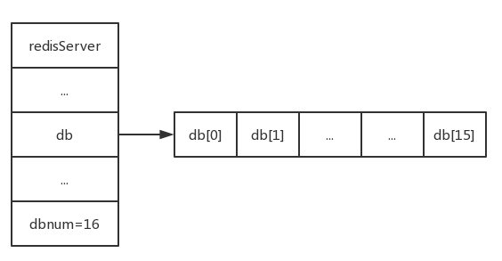
    - `redisClient` 维护了一个 `db` 指针，切换数据库时修改这个指针就行
    - 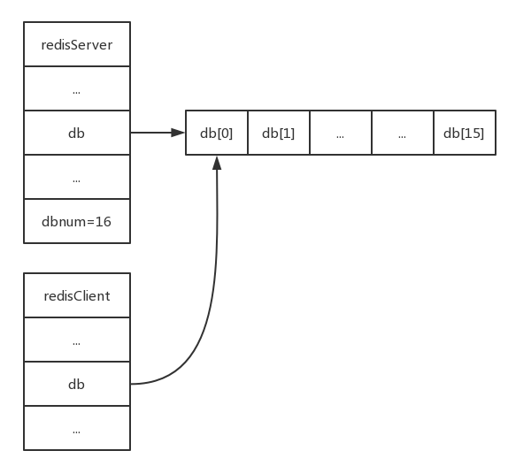
    - `redisDb` 结构中存储了 Redis 数据库中的所有键值对，它就是 `dict` 字段，这个字典就是 `Redis` 的键空间，键空间中存储了所有键值对
    - 键是字符串对象，添加键、修改键、删除键、获取键都是在对这个字典进行操作
    - 在 `redisDb` 结构中，有一个专门来保存数据库中所有键的过期时间的字典，`expires` 字典，它的键是一个指针，指向键空间中的某个值；值是一个 `long long` 类型的整数，是一个毫秒精度的时间戳
    - Redis 删除键：
        1. 定时删除：设置过期时间的同时会有一个定时器，过期时间到时定时器会删除这个键值对，缺点是占用较多的 CPU 时间
        2. 惰性删除：再取出键值对时检查是否过期，缺点是占用内存较大
        3. 定期删除：定时删除和惰性删除的折中
    - 实际只使用了惰性删除和定期删除
        - 惰性删除：`db.c/expireIfNeeded` 函数实现，所有读写命令在对数据库执行之前都贵调用这个函数进行检查
        - 定期删除：`server.c/activeExpireCycle` 函数实现，当 Redis 周期性操作 `server.c/serverCron` 函数时，它会调用 `activeExpireCycle` 函数，从数据库中随即筛选出过期的键值对

13. Redis 数据库通知
    - 数据库通知功能实现了让客户端通过订阅指定的消息频道或消息模式，来动态获取数据库中键的变化，以及数据库中命令的执行情况
    - 键空间通知 主要关注某个键执行了什么命令， `SUBSCRIBE __keyspace@__0:message` 订阅对数据库 `0` 键 `message` 的所有命令
    - 键命令通知 只要关注某个命令在什么键上执行，`SUBSCRIBE __keyevent@0__:set` 订阅 `SET` 命令操作的键
    - 默认数据库通知功能是关闭的，使用 `CONFIG SET` 添加，或者修改 `redis.windows.conf` 文件

14. Redis 客户端
    &emsp;&emsp;Redis 数据库采用 I/O 多路复用技术实现文件事件处理器，服务器采用单线程单进程的方式来处理请求，同时与多个客户端建立网络连接，并创建相应的 `redis.h/redisClient` ，其中保存了客户端连接的相关属性以及执行相关功能使得数据结构

    1. Redis 客户端属性
        - ```
        localhost:6379> CLIENT LIST
        id=2 addr=127.0.0.1:53820 fd=7 name= age=57 idle=0 flags=N db=0 sub=0 psub=0 multi=-1 qbuf=0 qbuf-free=32768 obl=0 oll=0 omem=18446744073709537584 events=r cmd=client
          ```
        - 名字属性
            - `name= `
            - 默认情况下连接到 Redis 的客户端时没有 `name` 属性的
            - 可以使用 `CLIENT SETNAME name` 添加 `name` 属性
            - 在没有设置 `name` 属性时， `name` 指向的是一个空指针，设置之后指向的是一个字符串对象
        - 套接字属性
            - `fd=7`
            - 客户端套接字由 `fd`记录，可能时 `-1` ，也可能时大于 `-1` 的整数
            - `fd = -1` ，表示是一个伪客户端，伪客户端的请求命令不是来源于网络的，而是来源于 `Lua` 脚本或 `AOF `文件，所以不需要套接字描述符 `fd` ，
            - `fd > -1` ，表示是一个普通客户端
        - 标志属性
            - `flags=N`
            - 记录客户端的角色以及客户端目前所处的状态
            - `flag` 属性的取值可以是单个标志，也可以是多个二进制或的组合标志
                1. `flags = <flag>`
                2. `flags = <flag1>|<flag2>|<flag3>|...`
            - 标志使用常量表示，在 `redis.h` 文件中
        - 时间属性
            - `age=57 idle=0`
            - `age` 记录了连接秒数
            - `idle` 记录了离最后一次与服务端交互过去的时间
    2. 客户端缓冲区
        - 服务器采用**软性限制**和**硬性限制**两种模式来限制客户端缓冲区大小
        - 软性限制所设置的大小小于缓冲区大小，并且缓冲区大小小于硬性限制大小，服务器或使用客户端状态结构的 `obuf_soft_limit_reached_time` 属性来记录到达软性限制的时间，之后如果这个时间超过了服务器设定的时长，这个客户端会被关闭，反之会被设置为 `0` ，如此反复
        - 缓冲区大小超过硬性限制，客户端就会被关闭
        - 使用 `client-output-buffer-limit <class> <hard limit> <soft limit> <soft seconds>` 设置 软性限制和硬性限制

            - `<class>` 为 `normal` 普通客户端、`slave` 从服务端客户端 、`pubsub` 执行消息订阅发布的客户端
        - 客户端缓冲区分为**输入缓冲区**和**输出缓冲区**
            - 输入缓冲区
                - 用于保存客户端发送的命令
                - 大小动态变化，最大 1G ，超过 1G 会被关闭
            - 输出缓冲区
                - 用于保存请求命令返回值
        - 每个客户端由两个输出缓冲区，一个大小固定，一个大小可变
            - 固定大小的用于缓冲长度较**小**的返回值
            - 可变大小的用于缓存长度较**大**的返回值
        - `buf` 和 `bufpos` 组成了客户端固定大小的缓冲区
            - `buf` 是一个字节数组，默认大小 `16 × 1024`
            - `bufpos` 记录了使用的字节数量
        - 当 `buf` 已满或者因为 返回值太大无法加入时，会使用可变缓冲区
        - 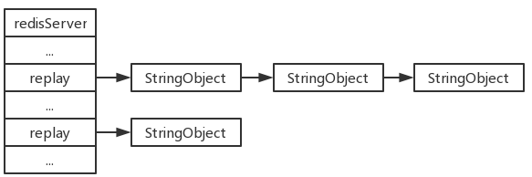
        - `replay` 属性维护了一个可变大小的缓冲区，以链表形式存储
    3. 客户端 `authenticated` 属性

        - `authenticated` 记录了客服端身份验证，验证成功设置为 `1` ，验证失败设置为 `0`
            - `AUTH` 命令执行验证
    4. 客户端 `argv` 和 `argc` 属性
        - 控制台输入的命令存储的地方
        - `argv` 存放命令的字符串数组
        - `argc` 数组长度
        - 客户端发送命令到服务端时，服务端会将命令保存到客户端的 `querybuf` 属性中，然后分析得出 `argc` 和 `argv`
          - 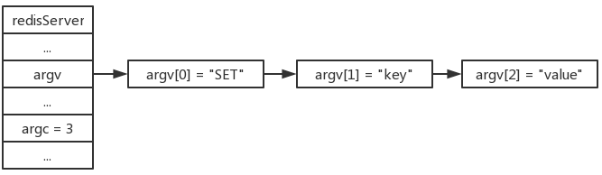
    5. 关闭客户端
        - `CILENT kill`
        - ...

15. Redis 服务端

     1. 服务器处理命令请求
         - 以 `SET city "beijing"` 为例
             1. 用户将命令输入客户端控制台，客户端接收此命令
             2. 客户端将命令发送给服务端
             3. 服务端接受处理，成功之后返回 `OK`
             4. 服务区将 `OK` 返回给客户端
             5. 客户端接收到返回值 `OK` ，展现给用户
         - 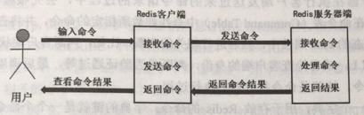
     2. 客户端发送命令给服务器
         - Redis 在发送命令给服务器之前，会对进行编码，是服务器可以识别，然后再通过 socket 通道发送编码后的命令

         - 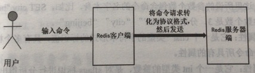
     3. 服务器执行命令
         - 服务器接收到客户端发送的命令之后会执行以下过程
             1. 读取 socket 传输的命令，然后保存到客户端的输入缓冲区中
             2. 分析命令，保存到客户端的 `argv` 和 `argc` 属性
             3. 执行命令
         - 执行过程首先会根据 `argv[0]` 的值在命令表中查找命令，将查找的的命令保存到客户端的 `cmd` 属性中，之后进行一系列验证，最后调用函数执行
         - 命令表是一个字典，键是命令名称，值是 `redisCommand` 结构
             - `name` 属性：指令的名称
             - `proc` 属性：函数指针，指向命令实现的函数
             - `arity` 属性：命令参数长度，包含命令本身（`-N` 表示命令最大长度为 `N` ）
     4. 服务器返回命令结果
         - 在相关实现函数调用过程完毕之后，会执行一些后续工作
             - 修改 `redisCommand` 结构中的属性，`milliseconds`、`calls` 等
             - 如果服务器开启慢查询日志，是否添加慢查询日志
         - 如果服务器开启 `AOF` 持久化，命令会被写入到 `AOF` 缓冲区
         - 从服务器正在同步本服务器，则会将命令发送到从服务器
         - 处理完后续工作，调用命令回复处理器，编码返回值后向套接字中写入，客户端收到返回之后，会进行解码显示给用户
           - 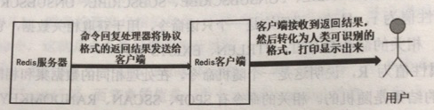

16. 服务端函数
    1. `serverCron` 函数
        - 服务器中一个重要的函数，负责管理服务器资源
        - 默认每个 `100ms`  执行一次
        - 会调用相关子函数， `trackOperationPerSecond` 、`SigtermHandler`、`clientCron`、`databasesCron`等
    2. `trackOperationPerSecond` 函数
        - 采用抽样计算的方式计算一秒内服务器处理的命令请求数量
        - `INFO stats` 中 `instantaneous_ops_per_sec` 记录
        - 通过计算 `REDIS_OPS_SEC_SAMOLES` 次取样的平均值估算
    3. `SigtermHandler` 函数
        -  Redis 服务器进程的 SIGTERM 信号关联处理器
        - 服务器启动的时候会执行，负责在接收到 SIGTERM 信号时，打开 `shutdwon_asap` 标识
        - 调用 `serverCron`  函数时会首先判断  `shutdwon_asap` 标识，为 `1` 则关闭服务器
    4. `clientCron` 函数
        - 对一定数量的客户端进行检查
          1. 检查客户端是否已经超时，超时则关闭
          2. 检查客户端输入缓冲区大小，超出一定范围则释放这个缓冲区并新建一个默认大小的缓冲区以免消耗更多的内存
    5. `databasesCron` 函数
        - 检查部分数据库，删除过期的键值对，对 Redis 数据字典进行相关的收缩操作

17. 服务器属性
    1. `cronloops` 属性 - 记录 `serverCron` 函数执行的次数
    2. `rdb_child_pid` 与 `aof_child_pid` 属性
        - 记录 Redis 服务器持久化操作的运行状态，记录执行 `BGSAVE` 和 `BGREWRITEAOF`命令的子进程 ID
        - 都为 `-1` 表示没有执行持久化操作
        - 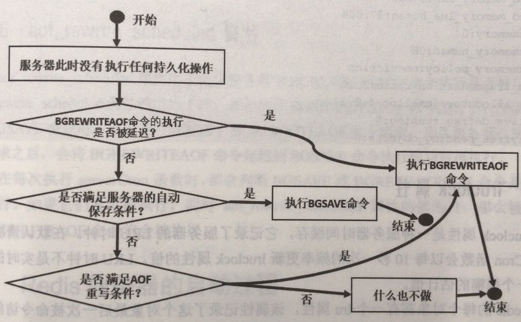
    3. `stat_peak_memory` 属性
        - 记录服务器内存峰值大小
        - `serverCron` 函数执行时，会更新该属性
        - `INFO memory` 中 `used_memory`
    4. `lruclock` 属性
        - 服务器的 LRU 时钟，不是实时的，`serverCron` 以 `10` 秒一次更新
        - Redis 每个对象都有一个 `lru` 属性，标志最近一次被访问的时间 ，两者相减就能得到对象多久没有被访问
        - `INFO server` 中 `lru_clock`
    5. `mstime` 与 `unixtime` 属性
        - 记录服务器时间
        - `serverCron` 以 `100` 毫秒一次更新
    6. `aof_rewrite_scheduled` 属性
        - 记录 `BGREWRITEAOF` 执行是否被延迟

18. Redis 服务器启动过程
    1. 服务器状态结构初始化
       - 创建一个 `struct redisServer` 类型的实例变量 `server`，`redis/initServerConfig` 函数初始化
       - `redis/initServerConfig` 除了创建命令表之外不会创建其他任何东西，初始化一些基本属性

    2. 相关配置参数加载
       - 加载 `redis.conf` 文件的配置

    3. 服务器数据结构初始化
       - 调用 `initServer` 初始化数据结构
          - `server.clients` 链表：记录客户端状态，包含一个 `redisClient` 结构实例
          - `server.pubsub_channels` 字典： 保存频道订阅消息
          - `server.pubsub_patterns` 链表：保存模式订阅消息
          - `server.lua`：执行 Lua 脚本的运行环境
          - `serverslowlog`：保存慢查询日志
       - 此外
          - 设置服务器的进程信号处理器
          - 初始化 I/O 模块
          - 创建共享对象，类似常量池
          - 监听客户端连接
          - 为 `serverCron` 函数创建事件事件，等待服务器正式运行时执行 `serverCron` 函数
          - 为 `AOF` 文件的写入做好准备，如果以及开启 `AOF` 持久化功能，则直接打开 `AOF` 文件，否则创建 `AOF` 文件并打开它
    4. 数据库状态处理
       - 加载 `RDB` 或 `AOF` 文件，启用 `AOF` 使用 `AOF` 文件还原数据库，反之使用 `RDB` 还原数据库
       - `[8624] 29 Oct 14:00:10.118 * DB loaded from disk: 0.015 seconds`

    5. 执行服务器循环事件
       - 开始接收客户端请求
       - `[10580] 28 Oct 15:10:53.214 * The server is now ready to accept connections on port 6379`

19. Redis 底层数据结构

     1. Redis 简单动态字符串（SDS）

         - SDS 不仅可以保存数据库中的字符串值，还可以实现 AOF 模块下的 AOF 缓冲区，以及实现客户端状态的输入缓冲区

         - SDS 是一个 C 语言结构体，位于 Redis 安装目录下的 src 目录下，每个 `sds.h/sdshdr` 结构表示一个 SDS 值

         - ```c
             typedef char *sds;

             /* Note: sdshdr5 is never used, we just access the flags byte directly.
              * However is here to document the layout of type 5 SDS strings. */
             struct __attribute__ ((__packed__)) sdshdr5 {
                 unsigned char flags; /* 3 lsb of type, and 5 msb of string length */
                 char buf[];
             };
             struct __attribute__ ((__packed__)) sdshdr8 {
                 uint8_t len; /* used */
                 uint8_t alloc; /* excluding the header and null terminator */
                 unsigned char flags; /* 3 lsb of type, 5 unused bits */
                 char buf[];
             };
             struct __attribute__ ((__packed__)) sdshdr16 {
                 uint16_t len; /* used */
                 uint16_t alloc; /* excluding the header and null terminator */
                 unsigned char flags; /* 3 lsb of type, 5 unused bits */
                 char buf[];
             };
             struct __attribute__ ((__packed__)) sdshdr32 {
                 uint32_t len; /* used */
                 uint32_t alloc; /* excluding the header and null terminator */
                 unsigned char flags; /* 3 lsb of type, 5 unused bits */
                 char buf[];
             };
             struct __attribute__ ((__packed__)) sdshdr64 {
                 uint64_t len; /* used */
                 uint64_t alloc; /* excluding the header and null terminator */
                 unsigned char flags; /* 3 lsb of type, 5 unused bits */
                 char buf[];
             };
             ```

         - 底层源码定义了多个结构体，每个结构体有四个参数

             1. `len`：属性记录了 SDS 的长度
             2. `alloc`：记录了分配给 SDS 的空间大小
             3. `flag`：标志，利用八个位记录信息
             4. `buf[]`：字符数组，存储实际内容

         - C 语言字符串与 SDS 区别

             - 二进制安全就是，字符串不是根据某种特殊的标志（C 语言的 `'\0'` ）来解析的，无论输入是什么，总能保证输出是处理的原始输入而不是根据某种特殊格式来处理
             - C语言字符串的 API 是二进制不安全的，可能会存在缓冲区溢出；它只能文本数据；可以使用 <string.h> 中的所有函数；修改需要重新分配内存，获取长度 `*O(N)*`
             - SDS 的 API 是二进制安全的，不存在缓冲区溢出；可以存储文本数据或二进制数据；可以使用 <string.h> 的部分函数；修改需要重新分配内存，获取长度 `*O(1)`*

     2. Redis 链表

         1. 使用
             - 当键包含元素过多或过长会使用链表存储
             - 消息订阅发布、监视器、慢查询都使用了链表
             - 服务器使用链表来保存多个客户端状态信息
             - 客户端输出缓冲区

         2. 实现

             - 链表节点使用 `adlist.h/listNode` 结构体实现

             - ```c
                 typedef struct listNode {
                     struct listNode *prev;   //前驱节点
                     struct listNode *next;   //后继节点
                     void *value;             //节点存储值
                 } listNode;
                 ```

             - ```c
               typedef struct list {
                   listNode *head;                      //链表头节点
                   listNode *tail;                      //链表尾节点
                   void *(*dup)(void *ptr);             //节点复制函数
                   void (*free)(void *ptr);             //节点删除函数
                   int (*match)(void *ptr, void *key);  //节点比较函数
                   unsigned long len;                   //链表长度
               } list;
               ```

             - 双向链表，`head` 的 `pre` 为 `null` ， `tail` 的 `next` 为 `null`

     3. Redis 压缩列表（ziplist）

          1. 压缩列表特点
              - 当一个列表键包含的元素较少时，且这些元素要么是小整数，要么是短字符，Redis 就会采用 压缩列表实现存储
              - 当一个哈希键包含的键值对较少时，且这些键值对的键和值要么是小整数，要么是短字符，Redis 就会采用 压缩列表实现存储
              - 压缩列表是一个顺序型数据结构，是一片连续的内存
              - 一个压缩列表可以包含任意多个节点，每个节点保存一个整数或字节数组

         2. ```
                 [0f 00 00 00] [0c 00 00 00] [02 00] [00 f3] [02 f6] [ff]
                       |             |          |       |       |     |
                    zlbytes        zltail    entries   "2"     "5"   end
             ```
              - `zlbytes` ：结构的字节长度，压缩列表在进行内存分配或计算 `zlend` 位置时才会使用
              - `zltail` ：最后一个元素的偏移，`0` 开始
              - `entries` ：节点个数，当 `entries < 65535` 时，可以从他直接获得节点个数 ，反之需要遍历来计算
              - `end` ：结尾标识

         1. 
              1. `previous_entry_length` 前一个节点的长度，可以为 `3` 字节或者 `5` 字节    
                 - 当前一个节点长度小于 `254` 字节时，该属性为 `3` 字节
                 - 反之则为 `5` 字节， 其中第一个字节为 `0xFF` ，剩下四个字节保存长度
              2. `encoding` 保存了 `content` 中的数据内容类型
    
                 - `1` 字节长， `00` 开头，表示 `content` 是长度小于等于 `2^6 - 1` 字节的字节数组
                 - `1` 字节长， `11` 开头
    
                   - `1100 0000` int16_t
                   - `1101 0000` int32_t
                   - `1110 0000` int64_t
                   - `1111 0000` 24 位有符号整数
                   - `1111 1110` 8 位有符号整数
                   - `1111 xxxx `这个编码下没有 `content` 属性，表示 `0 -  12` 大小的值
                 - `2` 字节长， `01` 开头，表示content是长度小于等于 `2^14 - 1` 字节的字节数组
                 - `5` 字节长， `10` 开头，表示content是长度小于等于 `2^32 - 1` 字节的字节数组
              3. `content` 保存了节点的值，可以是整数，也可以是字节数组
    
    4. Redis 快速列表（quicklist）
    
          1. 快速列表是**压缩列表**组成的双向链表，链表的每个节点都是一个压缩列表
    
          2. 快速列表的定义位于 `quicklist.h` 中
    
               - ```c
                    typedef struct quicklist {
                        quicklistNode *head;
                        quicklistNode *tail;
                        unsigned long count;        /* total count of all entries in all ziplists */
                        unsigned long len;          /* number of quicklistNodes */
                        int fill : 16;              /* fill factor for individual nodes */
                        unsigned int compress : 16; /* depth of end nodes not to compress;0=off */
                    } quicklist;
                    ```
    
               - `fill` ： 占 int 类型的 16 位
    
               - `compress` ： 占 int 类型的 16 位
    
               - ```
                    # Lists are also encoded in a special way to save a lot of space.
                    # The number of entries allowed per internal list node can be specified
                    # as a fixed maximum size or a maximum number of elements.
                    # For a fixed maximum size, use -5 through -1, meaning:
                    # -5: max size: 64 Kb  <-- not recommended for normal workloads
                    # -4: max size: 32 Kb  <-- not recommended
                    # -3: max size: 16 Kb  <-- probably not recommended
                    # -2: max size: 8 Kb   <-- good
                    # -1: max size: 4 Kb   <-- good
                    # Positive numbers mean store up to _exactly_ that number of elements
                    # per list node.
                    # The highest performing option is usually -2 (8 Kb size) or -1 (4 Kb size),
                    # but if your use case is unique, adjust the settings as necessary.
                    list-max-ziplist-size -2
                    ```
    
               - ```
                    # Lists may also be compressed.
                    # Compress depth is the number of quicklist ziplist nodes from *each* side of
                    # the list to *exclude* from compression.  The head and tail of the list
                    # are always uncompressed for fast push/pop operations.  Settings are:
                    # 0: disable all list compression
                    # 1: depth 1 means "don't start compressing until after 1 node into the list,
                    #    going from either the head or tail"
                    #    So: [head]->node->node->...->node->[tail]
                    #    [head], [tail] will always be uncompressed; inner nodes will compress.
                    # 2: [head]->[next]->node->node->...->node->[prev]->[tail]
                    #    2 here means: don't compress head or head->next or tail->prev or tail,
                    #    but compress all nodes between them.
                    # 3: [head]->[next]->[next]->node->node->...->node->[prev]->[prev]->[tail]
                    # etc.
                    list-compress-depth 0
                    ```
    
     5. Redis 字典（dict）
    
          1. Redis 数据库底层采用字典实现，增删改查都是建立在字典的基础上的
    
          2. 当哈希键内的键值对较多时，会采用字典存储
    
          3. Redis 采用哈希表实现字典的底层，定义位于 `dict.h`
    
               - ```c
                    /* This is our hash table structure. Every dictionary has two of this as we
                     * implement incremental rehashing, for the old to the new table. */
                    typedef struct dictht {
                        /*dictEntry中保存了一个键值对*/
                        dictEntry **table;
                        /*table数组的长度，哈希表大小*/
                        unsigned long size;
                        /*用于计算索引值，等于 size - 1 ，与哈希值共同决定键值对存放位置*/
                        unsigned long sizemask;
                        /*记录已使用的数量*/
                        unsigned long used;
                    } dictht;
                    ```
    
               - ```c
                    typedef struct dictEntry {
                        /*键*/
                        void *key;
                        /*值，可以是指针、无符号 64 位整数，有符号 64 位整数，双精度浮点是*/
                        union {
                            void *val;
                            uint64_t u64;
                            int64_t s64;
                            double d;
                        } v;
                        /*下一个键值对的指针*/
                        struct dictEntry *next;
                    } dictEntry;
                    ```
    
               - ```c
                    typedef struct dict {
                        /*dictType 结构的指针，保存了操作键值对的函数*/
                        dictType *type;
                        /*传递给函数的参数*/
                        void *privdata;
                        /*两张哈希表，通常只是用 ht[0] ，在 rehash 的时候会使用 ht[1]*/
                        dictht ht[2];
                        /*记录 rehash 的进度*/
                        long rehashidx; /* rehashing not in progress if rehashidx == -1 */
                        /*正在访问的迭代器数量*/
                        unsigned long iterators; /* number of iterators currently running */
                    } dict;
                    ```
    
               - ```c
                    typedef struct dictType {
                        /*计算哈希值， MurmurHash2*/
                        uint64_t (*hashFunction)(const void *key);
                        /*复制键*/
                        void *(*keyDup)(void *privdata, const void *key);
                        /*复制值*/
                        void *(*valDup)(void *privdata, const void *obj);
                        /*比较键*/
                        int (*keyCompare)(void *privdata, const void *key1, const void *key2);
                        /*销毁键*/
                        void (*keyDestructor)(void *privdata, void *key);
                        /*销毁值*/
                        void (*valDestructor)(void *privdata, void *obj);
                    } dictType;
                    ```
    
               - ```c
                    hash = dict -> type -> hashFunction(key)
                    index = hash & dict -> ht[x].sizemask /*index = hash % ht[x] -> size*/
                    ```
    
     6. Redis 整数集合（intset）
    
          1. Redis 底层使用整数集合来保存整数值类型的集合键
    
          2. 整数集合定义于 `intset.h` 中
    
               - ```c
                    typedef struct intset {
                        /*编码格式，什么编码觉得保存什么类型，INTSET_ENC_64、INTSET_ENC_32、INTSET_ENC_16*/
                        uint32_t encoding;
                        /*集合中包含的元素数量*/
                        uint32_t length;
                        /*
                        所保存的值取决于编码
                        INTSET_ENC_16：将 contents 转换为 int16_t 类型的数组，之后进行访问
                        INTSET_ENC_32：将 contents 转换为 int32_t 类型的数组，之后进行访问
                        INTSET_ENC_64：将 contents 转换为 int64_t 类型的数组，之后进行访问
                        contents 长度为 sizeof(INTSET_ENC_xx) * length
                        */
                        int8_t contents[];
                    } intset;
                    ```
    
          3. 把高精度整数存到低精度整数集合时，会扩展整数集合
    
     7. Redis 跳表（zskiplist）
    
           1. Redis 跳表是一个有序的数据结构，每个节点中由多个指向其他节点的指针
    
           2. 有序集合的底层实现就是跳表，当有序集合元素众多，或成员时较长字符串，会使用跳表存储
    
           3. Redis 跳表数据结构主要用在有序集合和集群节点中
    
           4. 跳表的定义在 `redis.h/zskiplistNode` 和 `redis.h/zskiplist` 中
    
                - ```c
                     typedef struct zskiplist {
                         /*表头节点和表尾节点*/
                         struct zskiplistNode *header, *tail;
                         /*节点个数，不含表头*/
                         unsigned long length;
                         /*除头节点外的最大层数*/
                         int level;
                     } zskiplist;
                     ```
    
                - ```c
                  typedef struct zskiplistNode {
                      /*该节点在各层的信息，柔性数组成员，程序初始化随机一个 1 - 32 的层高度*/
                      struct zskiplistLevel {
                          /*指向下一个节点*/
                          struct zskiplistNode *forward;
                          /*到达后一个节点的跨度，两个相邻节点span为1，forward 为 null ，跨度为 0 */
                          unsigned int span;
                      } level[];
                      /*指向上一个节点,用于zrevrange命令*/
                      struct zskiplistNode *backward;
                      /*zset的member*/
                      robj *obj;
                      /*zset的score*/
                      double score;
                  } zskiplistNode;
                  ```
    
                - 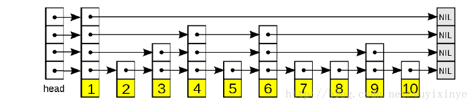
    
     8. Redis 对象
    
           1. 介绍
    
                - Redis 并没有直接使用上述的数据结构，而是在这些基础上建立了一个对象系统，包含了物种数据对象，分别是字符串对象、列表对象、哈希对象、集合对象、有序集合对象
                - 一个对象是否可以执行给定命令时根据类型来判断的
                - 对象系统使用引用计数器实现内存回收
                - 引用技术实现共享对象
                - Redis 对象带有访问时间信息，用于计算数据库键的空转时间，如果开启了 maxmemory 功能，空转时间较大的键可能会被服务器删除
    
           2. 对象类型
    
                - 当创建一个键值对的时候，至少会创建两个对象，一个用作键，一个用作值
    
                - ```c
                  typedef struct redisObject
                  {
                      /*对象类型 REDIS_STRING REDIS_LIST REDIS_HASH REDIS_SET REDIS_ZSET*/
                      unsigned type:4;
                      /*编码决定底层用什么数据结构存储*/
                      unsigned encoding:4;
                      /*指向数据结构的指针*/
                      void *ptr;
                  	...
    
                  } robj;
                  ```
    
                  - Redis 数据库中保存的键值对键总是一个 `REDIS_STRING` 类型对象，`TYPE` 命令查看的是值的类型
                  - `encoding`
                    - 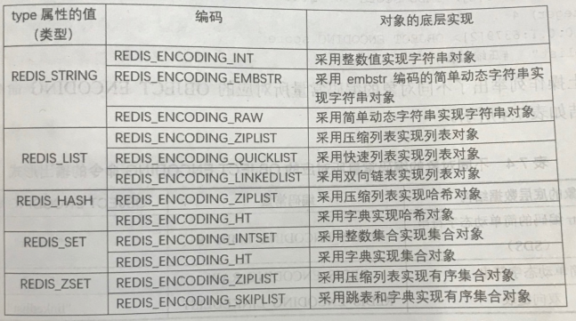
    
           3. 对象编码方式
    
                 1. 字符串对象
                      - `int` ：long 类型的整数值，保存在对象的 `ptr` 指针
                      - `raw` ：长度超过 `32` 字节的字符串值，使用 `SDS` 保存
                      - `embstr` ：长度小于等于 `32` 字节，使用 `embstr` 编码
                      - `int` 和 `raw` 编码在满足一定条件的时候会转化为 `raw`
                 2. 哈希对象
                      - `ziplist` ：键值对的长度超过 `64` 字节，键值对个数大于 `512`
                      - `hashtable`：不满足上面条件时
                      - `ziplist` 编码时，插入时在表尾
                 3. 列表对象
                      - `ziplist` ：列表元素保存在压缩列表节点中
                      - `quicklist：` 每个节点又是一个压缩列表
                      - `linkedlist` ：列表元素保存在双向链表节点中
                      - 满足以下条件采用 `ziplist` 存储，反之使用 `quicklist` 存储
                           - 列表对象保存的所有字符串元素长度小于 `64` 字节
                           - 列表对象保存的元素少于 `512` 个
                 4. 集合对象
                      - `intset` ：集合包含的所有元素都会存储在这个整数集合中
                      - `hashtable` ：键包含一个字符串对象，字符串对象包含集合元素，值为 `null`
                      - 满足以下条件采用 `intset` 存储，反之使用 `hashtable` 存储
                           - 集合对象中的所有元素都是整数
                           - 集合对象中的元素个数少于 `512` 个
                 5. 有序集合对象
                      - `ziplist` ：使用两个压缩列表节点存储，前一个存储 `member`，后一个存储` `score`
                      
                      - `skiplist` ：包含了一个字典和跳表
                      
                           - ```
                                The elements are added to a hash table mapping Redis objects to scores. At the same time the elements are added to a skip list mapping scores to Redis objects (so objects are sorted by scores in this "view").
                                ```
                      
                                字典保证元素各不相同，`skiplist `实际存储
                      
                      - 满足以下条件采用 `ziplist` 存储，反之使用 `skiplist` 存储
                        
                           - 有序集合保存的元素长度小于 `64` 字节
                           - 有序集合保存的元素个数少于 `128` 个
    
20. Redis 排序

     ```
     SORT key [BY pattern] [LIMIT offset count] [GET pattern [GET pattern ...]] [ASC|DESC] [ALPHA] [STORE destination]
     ```

     1. `SORT` 排序命令

        - 排序 `zset` 时会忽略分数
        - 没有 `ALPHA` 参数时会尝试将排序的值转化为 `double` 进行排序
        - 通过添加 `ALPHA` 参数可以对字符串进行排序

     2. `ASC` 与 `DESC` 参数

        - `ASC` 升序
        - `DESC` 降序

     3. `BY` 参数

        - 有且仅有一个

        - 排序默认按照元素本身的值进行排序

        - 使用 `BY` 参数可以修改排序时的参照键，如果这个键的值是字符串，还需要添加 `ALPHA` 参数，`BY` 可以指定某一个字符串键或者哈希键的某一个域

        - ```
          localhost:6379> SADD unsortedset red green blue yellow
          (integer) 4
          localhost:6379> SMEMBERS unsortedset
          1) "green"
          2) "red"
          3) "yellow"
          4) "bule"
          localhost:6379> MSET blue-key 10 yellow-key 20 red-key 30 green-key 40
          OK
          localhost:6379> SORT unsortedset BY *-key
          1) "bule"
          2) "yellow"
          3) "red"
          4) "green"
          localhost:6379> HMSET green-map weight 1 value green
          OK
          localhost:6379> HMSET red-map weight 10 value red
          OK
          localhost:6379> HMSET blue-map weight 3 value blue
          OK
          localhost:6379> HMSET yellow-map weight 13 value yellow
          OK
          localhost:6379> SORT unsortedset BY *-map->weight
          1) "green"
          2) "blue"
          3) "red"
          4) "yellow"
          ```

     4. `LIMIT` 参数

        - 分页查询

     5. `GET` 参数

        - 可以有多个

        - ```
          localhost:6379> SORT unsortedset BY *-map->weight get *-map->weight get # get *-key
           1) "1"
           2) "green"
           3) "40"
           4) "3"
           5) "blue"
           6) "10"
           7) "10"
           8) "red"
           9) "30"
          10) "13"
          11) "yellow"
          12) "20"
          ```

     6. `STORE` 参数

        - 默认情况下服务器只会向客户端发送排序后的结果
        - 添加 `STORE` 参数可以将排序结果保存在一个列表对象中
        - 如果指定的 `key` 已经存在，则会覆盖旧值

     7. 多参数执行顺序

        1. 排序，使用 `ALPHA ASC DESC BY`
        2. 分页，`LIMIT`
        3. 获取外部键，`GET`
        4. 返回结果给

21. Redis 事务

     1. Redis 事务的基本功能由 `MULTI`、`EXEC`、`DISCARD`、`WATCH`等命令实现

         - `MULTI` 用于启动事务，把客户端设置为事务状态
         - `EXEC` 命令用于提交事务，执行从 `MULTI` 到此命令前面的命令队列，此时客户端变为非事务状态
         - `DISCARD` 命令用于取消事务执行，清空事务命令队列，客户端退出事务状态
         - `WATCH` 命令用于监视某些键，当这些键没有发生变化时，事务才能正常执行

     2. 在执行一个客户端事务时，其他客户端的命令都不能被执行

     3. 当客户端连接发送 `MULTI` 命令时，这个连接会开启一个事务上下文，后续发送的指令都会被放入命令队列，知道 接收到 `EXEC` 命令后这些指令才会被一起执行

     4. Redis 事务的 ACID 特性

         1. 原子性

             - 事务的命令要么全部成功（?），要么全部失败（?）

             - 错误的命令不会影响事务执行

                 - ```
                     localhost:6379>  MULTI
                     OK
                     localhost:6379> SET acid1 hahah
                     QUEUED
                     localhost:6379> set acid2 iii
                     QUEUED
                     localhost:6379> set acid3 3
                     QUEUED
                     localhost:6379> INCRBY acid2 2
                     QUEUED
                     localhost:6379> EXEC
                     1) OK
                     2) OK
                     3) OK
                     4) (error) ERR value is not an integer or out of range
                     ```

             - 错误格式的命令会导致事务出错并且不执行其中的所有命令

                 - ```
                     localhost:6379> MULTI
                     OK
                     localhost:6379> SET acid1 hahah
                     QUEUED
                     localhost:6379> SET acid2 iii
                     QUEUED
                     localhost:6379> SET acid3 3
                     QUEUED
                     localhost:6379> INCR
                     (error) ERR wrong number of arguments for 'incr' command
                     localhost:6379> EXEC
                     (error) EXECABORT Transaction discarded because of previous errors.
                     ```

         2. 一致性

             - 事务在执行之前和执行之后，数据库的数据都能保证是正确和符合定义的
             - 命令格式或语语法错误
             - 格式正确，运行出错
             - 发生突发情况 `AOF` 或者 `RDB` 文件恢复

         3. 隔离性

             - 单线程执行事务

         4. 持久性

             - 如果没有采用 `AOF` 或 `RDB` 持久化方式，发生突发事件之后啥也没了
             - AOF 持久化方式
                 - `redis.conf` 的 `appendfsync` 为 `always` 时可以保证事务的持久性，服务器在执行命令之后都会保存数据到本地磁盘文件
                 - `redis.conf` 的 `appendfsync` 为 `everysec` 时无法保证事务的持久性，服务器每隔一秒保存数据到本地磁盘文件
                 - `redis.conf` 的 `appendfsync` 为 `no` 时无法保证事务的持久性，是否保存数据到本地文件，何时保存都是由操作系统控制的
             - `RDB` 持久化方式
                 - 满足特定条件才会执行 `BGSAVE` 命令将数据保存到本地文件

     5. 事务实现过程

         1. 使用 `MULTI` 命令开启事务
             - 执行该命令之后，客户端转化为事务状态，由 `flags` 属性通过添加 `REDIS_MULTI` 实现这一过程
         2. 事务命令入队列
             - 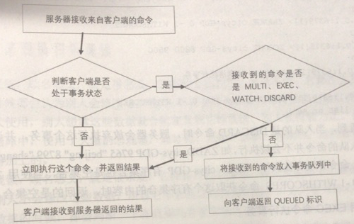
             - 每个客户端都有自己的事务状态， `mstate` 保存了这个状态
             - 事务状态有一个事务队列和一个入队命令的计数器组成
             - 事务队列是一个 `multiCmd` 类型的结构体数组， `FIFO` ，每一个元素保存着入队命令的信息，包括命令实现函数、命令参数、参数数量等
         3. 执行 `EXEC` 命令

     6. 悲观锁和乐观锁

     7. `WATCH` 命令

         1. `WATCH` 命令用于监视某些键，当这些键没有发生变化时，事务才能正常执行
         2. `WATCH key [key ...]`
         3. `WATCH` 可以被多次调用，也可以监视多个数据库的键
         4. `UNWATCH` 取消
         5. Redis 数据库有一个 `watched_keys` 字典，键是某个被监视的数据库键，值是一个链表，记录键是该键的所有客户端
         6. 执行对数据库修改的命令之后，都会调用 `multi.c/touchWatchKey` 函数对 `watched_keys` 字典进行检查，如果被修改的键在字典里，则会设置监视它的客户端的 REDIS_DIRTY_CAS 标识
         7. 执行 `EXEC` 是 服务器会判断客户端的 `REDIS_DIRTY_CAS`  标识来决定是否执行事务

     8. Redis 不支持事务回滚

     9. 处理事务的两种方式：事务功能和脚本功能
    
 22. Redis 消息订阅

      1. Redis  的消息订阅发布功能主要由 PSUBSCRIBE、PUBLISH、PUBSUB、 PUNSUBSCRIBE 、SUBSCRIBE 、UNSUBSCRIBE 等命令实现
          - 客户端使用 PUBLISH 向订阅者发布消息
          - 客户端使用 PSUBSCRIBE、SUBSCRIBE  成为订阅者
          - 发布者将消息发布到 Channel，订阅者订阅 Channel
          - PUBLISH channel message
          - SUBSCRIBE channel
          - PSUBSCRIBE pattern [pattern ...]
              - 订阅匹配这个模式的消息频道
              - ？、* 、[、] 都是通配符，可以使用 \ 进行转义
              - PSUBSCRIBE infor* mess*
                  - 匹配 infor 开头 和mess 开头的频道
          - PUNSUBSCRIBE [pattern [pattern ...]]
              - 不指定模式则取消订阅所有频道
          - UNSUBSCRIBE  [channel [channel ...]]
          - PUBSUB <subcommand> [argument [argument ...]]
              - PUBSUB CHANNELS [pattern]
                  - 遍历 pubsub_channels 找出有效的频道，不指定 pattern 则列出全部
              - PUBSUB NUMSUB [channel-1 channel-2 ... channel-N]
                  - 遍历 pubsub_channels 找出频道的订阅数量
              - PUBSUB NUMPAT
                  - 获取模式订阅的数量，使用 PUNSUBSCRIBE 订阅的数量
                  - 返回 pubsub_patterns 链表的长度
      2. 使用 SUBSCRIBE 建立的订阅频道关系会存储在 pubsub_channels 中，它是一个字典，键是频道，值是一个链表，包含了订阅这个频道的所有客户端
          - 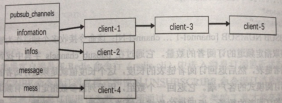
      3. 使用 PSUBSCRIBE 建立的订阅频道关系会存储在服务器状态的 pubsub_patterns 中，它是一个链表，每一个节点是 pubsubPattern 结构体，有 client 和pattern 两个属性
          - 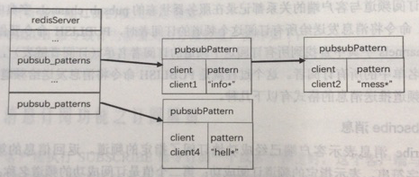
      4. Redis 消息队列
          - 消息订阅发布模式
              - 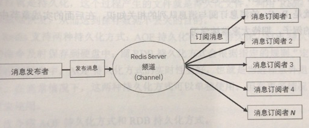
          - 消息生产者/消费者模式
              - 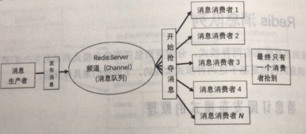

 23. Redis 持久化

      1. AOF 持久化

          - 默认关闭，`appendonly yes` 开启

          - AOF 实现过程

              1. 命令追加（append）：Redis 服务器没执行一条写命令，这条写命令就会被追加到缓存区 aof_buf 中
              2. AOF 持久化文件写入（write）和文件同步（sync）
                  - Redis 服务器进程是一个事件循环，其中的文件事件负责接收客户端的命令，返回处理之后的结果；时间时间负责执行 serverCron 这样需要定时执行的函数
                  - 每个事件循环结束之前，都会调用 flushAppendOnlyFile，这个函数的行为取决于 appendfsync （no，always，everysec）的值

          - AOF 文件重写

             - 随着执行的命令越来愈多，文件也会越来越大，定期重写 AOF 文件，可以达到压缩存储的目的

             - AOF 文件重写就是把进程里的数据转化为写命令，同步到 AOF 文件中

             - 重写过程新建了一个 AOF 文件，并不会操作旧文件

             - AOF 可以压缩存储的原因：

               1. 丢弃过期数据
               2. 丢弃无效命令，重复写键，重复删除键等
               3. 合并多条命令，多条写可以合并为一条

             - 为防止客户端缓冲区溢出，当键包含的元素个数大于 redis.h/REDIS_AOF_REWRITE_ITEMS_PER_CMD（64） 是，会使用多条命令记录这个键

             - 重写触发方式：

               - 手动触发：BGREWRITEAOF 命令

               - 自动触发：与配置参数有关（同时满足）

                 - ```
                   auto-aof-rewrite-percentage 100 //当前 AOF 文件大小和前一次文件大小比值百分比
                   auto-aof-rewrite-min-size 64mb  //执行重写的最小大小
                   ```

             - AOF 后台重写

               - 开启子线程重写 AOF，但是会导致数据库不一致，子线程无法看到其开始运行之后的命令
               - 为了方式数据库不一致， AOF 文件重写缓冲区被启用，被执行的命令同时放入 aof_buf 和 AOF 文件重写缓冲区
                 - 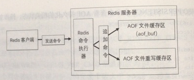
               - 子线程完成工作后，发送一个信号给父线程，父线程接收到这个信号调用信号处理函数将AOF 文件重写缓冲区里的内容写入 AOF 文件

         - 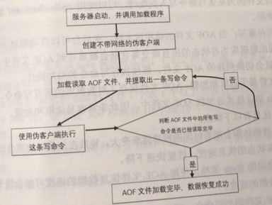

         - 如果 AOF 文件被破坏，服务器拒绝加载这个 AOF 文件以确保数据库状态一致

         - AOF 持久化优缺点：

             - 优点
                 1. 使持久化更长
                 2. 兼容性好
                 3. 支持后台重写
                 4. AOF 文件易于读取和加载
             - 缺点
                 1. AOF 文件大小会随着时间变大
                 2. 可能慢于 RDB 文件的恢复速度
                 3. 可能因为个别命令导致恢复失败

     2. RDB 持久化

         - 定期生成数据快照
             - 配置文件 save m n，在时间 m 内有 n 个键被修改则出发 BGSAVE 命令生成数据快照
             - 可以配置多个，满足任意一个就可以
             - serverCron 函数会检查是否满足条件，结合 dirty 和 lastsave 判断，满足触发 BGSAVE 命令
             - dirty： 计数器记录了修改的次数
             - lastsave：上次执行 SAVE 或 BGSAVE 命令的时间
         - 如果配置了自动快照，FLUSH 命令会在清除数据之前保存一次数据快照
         - 创建快照的时候 Redis 创建了一个子进程，和父进程共享内存，父进程接收客户端命令，子进程执行生成快照，使用 CopyOnWrite 策略，当父进程执行一条写命令时，会复制一份内存给子进程
         - 默认情况下 RDB 文件的压缩是开启的，采用 LZF 压缩算法，实际上只对数据库中超过 20 字节的字符串进行压缩

